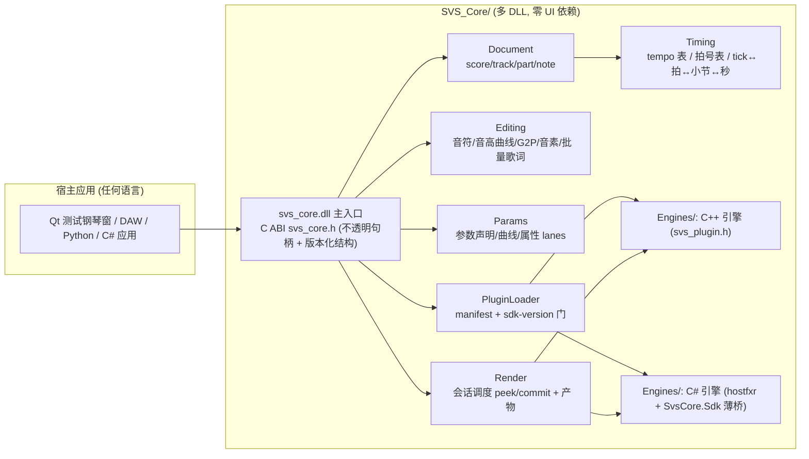
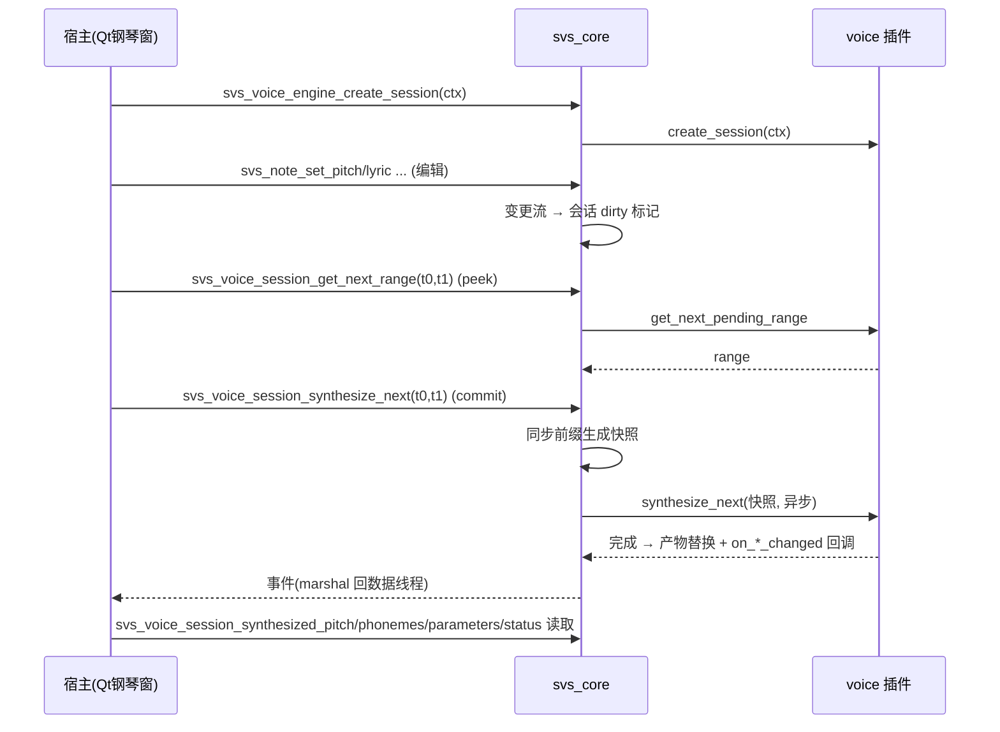

# SVS_CORE 开发计划书（C++ 独立歌声合成核心）

> 以 TuneLab（C#/.NET + Avalonia）为**参考实现**，抽出一个**不依赖 TuneLab、可独立编译运行的 C++ 完整内核 `SVS_Core/`**（多 DLL：主 DLL `svs_core.dll` + 子模块 DLL，全部所需运行库与引擎都收纳于 `SVS_Core/` 目录内）。它向其它应用（DAW、编辑器、任意语言宿主）提供歌声合成（SVS）所需的完整能力：**工程信息（BPM/拍号/时基换算）、钢琴窗编辑逻辑（音符/音高曲线/中文拼音/日语罗马音/音素预测与编辑/批量歌词）、参数栏逻辑（可调参数声明、参数曲线编辑与读取）、format 与 voice 插件加载与开发（C++ 与 C# 插件双轨）**，并给 voice 插件接口**新增声库头像（avatar/portrait）**。核心**零 UI 依赖**（不引 Qt）；另附一个**仅用于测试的 Qt 钢琴窗**验证程序，所有编辑逻辑都走 SVS_CORE API。
>
> 版本：v0.1（草案） · 日期：2026-09-01
>
> **硬性约束：本计划不得修改 TuneLab 本体**——TuneLab 仅作为只读参考实现，所有产物均为独立新增目录。

---

## 1. 背景与目标

### 1.1 现状：TuneLab 是功能完备但"绑定应用"的参考实现

TuneLab 是由 `TuneLab`（Avalonia 应用）+ `TuneLab.SDK`（插件契约，ABI 冻结 + PublicApiAnalyzers 守护）+ `TuneLab.Foundation`（数据基础设施）+ 各插件管理器（`ExtensionManager` / `VoicesManager` / `FormatsManager`）组成的完整 SVS 宿主。它已经解决了"**宿主侧**"的全部问题：

| TuneLab 能力 | 关键代码/接口 | 结论 |
|---|---|---|
| 工程/时基信息 | `TempoManager`/`TempoInfo{Pos(tick),Bpm}`、`TimeSignatureManager`/`TimeSignatureInfo{BarIndex,Numerator,Denominator}`、PPQ=480（`MusicTheory.RESOLUTION`）、`TempoConvert`、`ITimeSignatureManager.GetBarAndBeatIndexes/GetBeatIndexes/GetTicksForBarIndex` 等换算族 | 模型成熟、可整体移植 |
| 钢琴窗音符编辑 | `INote{Pos(tick),Dur,Pitch(MIDI 60=C4),Lyric,Pronunciation,Properties}`、`LeadingPhonemes/BodyPhonemes`（钉死音素双列表）、`BodyOffset`(秒)、`PianoScrollViewOperation`（移动/头尾缩放/增删/选择） | 模型可移植，交互手势属 UI 层、SVS_CORE 只提供**操作 API** |
| 音高曲线 | `PitchInfo{Segments}`（分段折线，X=tick、Y=MIDI 音高可带小数）、合成回显 `SynthesizedPitch{Segments}`（(秒,半音) 折线）、`IPiecewiseAutomation` | 分段折线 + 连续折线两种形态 |
| 中文→拼音 | `TuneLab/Utils/LyricUtils.cs`：`Pinyin` NuGet（`HanziToPinyin` 带声调、多音字候选）、`ManTone.Style.NORMAL`、分词正则 | 需在 C++ 侧换开源实现（见 4.5） |
| 日语→罗马音 | 同上：`Kana` NuGet（`KanaToRomaji`，含浊音/拗音/长音） | 规则表可内嵌，无需重量级依赖 |
| 音素预测与编辑 | `SynthesizedPhoneme{Symbol,Duration,StretchWeight}`、`PhonemeSlots`（slot=下标−引导数，0=核、<0 引导辅音、>0 核后）、`PhonemeLayout.Resolve`（纯函数布局）、`IVoiceSynthesisNote.Leading/BodyPhonemes`（G2P 由引擎或编辑器补） | 布局算法是**纯函数**，可直接 1:1 移植 |
| 批量歌词 | `LyricInput` 的 `LyricUtils.Split`（整段文本→分词→逐字 G2P→候选表→回填 notes）、`BatchSignal` 批量括号 | 核心 API 提供"分词+转换+按序回填" |
| 参数栏 | `IVoiceSynthesisEngine.GetAutomationConfigs`（可调参数声明：key/Min/Max/Color/Default）、`AutomationInfo{DefaultValue,Points}`（连续轨）、`PiecewiseAutomationInfo{Segments}`（分段轨，默认 NaN）、`GetPartPropertyConfig/GetNotePropertyConfig/GetPhonemePropertyConfigs`（属性面板 ObjectConfig）、`IVoiceSynthesisNote.Properties`（per-note/per-phoneme 键值属性）、`SynthesizedParameters`（引擎回显）、`AutomationRenderer*Operation`（曲线编辑手势） | 声明/存储/编辑三面，核心只做声明+存储+评估 |
| format 插件 | `IImportFormat.Deserialize(Stream)` / `IExportFormat.Serialize(Stream, ProjectInfo)`，DTO 家族（`ProjectInfo→TrackInfo→PartInfo→MidiPartInfo→NoteInfo…`）、后缀声明 | C 侧用流回调等价物 |
| voice 插件 | `IVoiceSynthesisEngine`（声库目录/Init/CreateSession/声明面）+ `IVoiceSynthesisSession`（DefaultLyric/IsContinuation/peek+commit 调度/SynthesizedPitch/SynthesizedParameters/SynthesizedPhonemes/Status/事件） | 进程内 .NET 接口，C++ 侧换 C ABI vtable |
| 插件加载 | `ExtensionManager`：manifest.json（`id/name/version/icon/sdk-version/extensions[{type,assembly,class,…}]`）→ 判代际（V1/Legacy）→ sdk-version 门 → per-folder ALC → 注册进各 manager；`IExtensionSettings` 扩展设置 | 流程可移植；`.NET` 加载改 `dlopen`/`LoadLibrary` + C# 则走 hostfxr |
| 声库元数据 | `VoiceSourceInfo{Name,Description,Portrait?}`（`Portrait`= `ImageResource` 立绘，显示在钢琴窗） | **头像接口参照此设计**，本计划在 C++ 侧显式给出 `avatar`+`portrait` |
| 合成调度 | 厚插件原则：分片/状态/缓冲/进度/脏判定全归插件；宿主只 push 变更流（`IVoiceSynthesisContext`）、驱动 peek/commit、读产物；快照 `VoiceSynthesisSnapshot` 隔离 worker | 会话模型直接沿用 |

**痛点（本计划解决的）**：TuneLab 是 `.NET` 应用，外部应用（如 C++ DAW、Qt 工具、Python 工具）无法直接复用其编辑与合成能力；其 SDK 也是 C# ABI，插件生态锁定 .NET。需要一个**语言中立的 C++ 核心**。

### 1.2 目标

1. 新建 **`svs_core`**（C++17/20，CMake），编译产出**自包含目录 `SVS_Core/`**：主 DLL `svs_core.dll`（Windows）/ `libsvs_core`（Linux/macOS）+ 若干**子模块 DLL**（G2P/布局/托管桥等）+ **全部所需运行库**，均位于 `SVS_Core/` 内（拷贝即用、不写系统路径）；**采用多 DLL 模式**——它是一个完整内核，不强制单文件；**引擎（voice/format 插件）统一放在 `SVS_Core/Engines/`**；整体**不依赖 TuneLab 任何代码/程序集**，独立编译、独立运行；
2. 以 **C ABI 为唯一稳定边界**：`svs_core.h`（`extern "C"`，不透明句柄 + 版本化 vtable + 错误码），任何语言（C++/C#/Python/Qt）都能绑定；
3. **信息获取**：tempo（BPM）表、time signature（拍号）表、PPQ=480 时基、tick↔拍↔小节↔秒的全套换算与查询 API；
4. **钢琴窗编辑逻辑**：音符 CRUD/移动/改音高/改歌词；**音高曲线**编辑（分段折线）；**中文转拼音**、**日语转罗马音**（含多音字候选）；**音素预测与编辑**（双列表钉死、slot 化、时长/伸缩权重、`PhonemeLayout` 纯函数布局）；**批量歌词**（整段文本→分词→G2P→按序回填音符）；
5. **参数栏逻辑**：可调参数声明获取（来自 voice 插件）、参数曲线（连续轨/分段轨）编辑与读取、按 note/音素分段属性（Properties）读写、引擎回显参数读取；
6. **format 与 voice 插件加载与开发**：统一插件加载器（manifest.json + sdk-version 门），**C++ 原生插件**（C ABI vtable）与 **C# 插件**（经 `hostfxr/nethost` 托管 .NET 运行时，薄 C ABI 桥）双轨支持；二者面向同一份 C ABI 契约；
7. **声库头像接口**：voice 插件声库目录 `svs_voice_source_info` 显式包含 **`avatar`（头像）与 `portrait`（立绘）** 两个可选 `svs_image` 字段（文件路径或内嵌字节+MIME），供钢琴窗/选择器展示；
8. **合成会话**：复用 TuneLab 的厚插件会话模型（peek/commit、SynthesizedPitch/Parameters/Phonemes/Status、变更事件、音频段交付），可导出 WAV/直出缓冲；
9. **开发期测试工具**：先以简单 **`svs_testexe`**（控制台，无 UI）测**逻辑/功能**——每完成一部分就跑冒烟/对拍；**涉及操作体验**（音符拖拽、曲线点编辑手感、音素带拖动等）的部分，再用 **Qt 钢琴窗程序**测试；
10. **Qt 测试钢琴窗**（仅测试）：`tests/QtSvsPianoRoll/` Qt6 Widgets 程序，所有编辑逻辑调用 SVS_CORE——核心**不依赖 Qt**；
10. **硬性约束：不改 TuneLab 本体**——本计划只**新增独立产物**（`SVS_Core/`、`tests/svs_testexe/`、`tests/svs_core_tests/`、`tests/QtSvsPianoRoll/`、`tests/engines/`、`tests/sdk-cs/`、`tools/svs_dumpbench/`），**不修改** `TuneLab/`、`TuneLab.*`、`legacy/`、`Bridge*` 等任何现有代码、工程文件与配置（TuneLab 仅作只读参考实现）。

### 1.3 非目标（v1 范围外）

- 不做完整 Avalonia 级 UI（钢琴窗以外：混音台/波形编辑器/设置窗等）；
- 不做 effect/instrument/agent 插件（v1 只做 format + voice；接口预留，后续版本按同类范式扩展）；
- 不移植 TuneLab 的 undo/redo 数据层（`DataObject.Push` 上溯 `DataDocument`）——核心提供**观感一致**的操作 API + 简易状态版本号（revision），宿主自管撤销；若后续需要，再加 `svs_undo_stack`（见 10 风险）；
- 不做实时音频引擎（ASIO/WASAPI/SDL 输出）——那是宿主的事，核心只产出**音频缓冲/段**；
- 不跟随 TuneLab 的 `TuneLab.SDK`/`TuneLab.Foundation` ABI（那些是 .NET 程序集契约，与 C++ 无关）；
- 不内置任何商业声库（voice 插件生态由第三方提供）；
- 不做 C♯ 插件在无 .NET 运行时机器上的自包含（`SVS_CORE_ENABLE_DOTNET_HOSTING` 为可选构建开关，关闭时 C# 插件报"平台不可用"）。

---

## 2. 术语

| 术语 | 含义 |
|---|---|
| SVS | Singing Voice Synthesis，歌声合成 |
| 核心（svs_core） | 本计划的 C++ DLL：数据模型 + G2P + 布局 + 参数 + 插件加载 + 合成驱动的公共库 |
| 宿主（Host） | 调用 SVS_CORE 的应用（DAW / Qt 测试钢琴窗 / Python 工具…） |
| 声库（Voice Source / Voice） | voice 插件暴露的一个可演唱音源（`svs_voice_source_info`） |
| C ABI | `svs_core.h` 与插件 `svs_plugin.h` 的 `extern "C"` 契约，唯一二进制稳定边界 |
| 分片（Synthesis Range） | 一次合成提交覆盖的时间窗（秒），产物以全局 0 时刻对齐 |
| peek/commit | 调度模型：`GetNextPendingSynthesisRange`（纯查询）→ `SynthesizeNext`（提交） |
| 钉死音素（Pinned Phonemes） | 用户显式编辑过的音素双列表（引导/主体）；为空 = 引擎 G2P |
| slot | 音素在 note 内的角色坐标：`slot = 下标 − 引导数`，0=核，<0=引导辅音，>0=核后 |
| manifest.json | 插件包元数据（id/name/version/sdk-version/extensions[]），加载唯一发现入口 |
| G2P | Grapheme-to-Phoneme：汉字→拼音 / 假名→罗马音 / 词→音素序列的转换 |

---

## 3. 关键技术决策

### 3.1 C ABI 为唯一稳定边界（语言中立）

- 公开面只有 `svs_core.h`（宿主面向）与 `svs_plugin.h`（插件面向），全部 `extern "C"` + 版本化；
- 对象模型：**不透明句柄**（`svs_handle`/`void*`），句柄内为 C++ 实现（`pimpl`）；
- 版本：`svs_core_get_api()` 返回 `const svs_core_api*`（struct of function pointers，带 `api_version`），宿主按主版本号匹配；`SVS_CORE_ABI_VERSION` 宏；
- 内存：宿主传入/取出的**数组一律 `{ptr, count}` 结构 + 固定生命周期约定**（`_free` 族或"借用指针 + version 号"）；字符串 UTF-8；
- 错误：`svs_status` 枚举 + `svs_last_error_message()`（线程局部）——与 TuneLab "异常只在调用边界 catch" 的思路对应，但 C 侧显式返回码；
- C++ 便捷层：`svs_core.hpp`（header-only 包装 RAII 类，可选，不参与 ABI）。

```c
/* svs_core.h —— 示意 */
typedef struct svs_context svs_context;      /* 全局上下文 */
typedef struct svs_score svs_score;          /* 工程文档 */
typedef struct svs_track svs_track;
typedef struct svs_part svs_part;
typedef struct svs_note svs_note;
typedef struct svs_automation svs_automation;/* 参数曲线轨 */
typedef struct svs_voice_engine svs_voice_engine;   /* 已加载 voice 插件 */
typedef struct svs_voice_session svs_voice_session; /* 一次 part 合成会话 */
typedef struct svs_format svs_format;        /* 已加载 format 插件 */

SVS_API const svs_core_api* svs_core_get_api(void);
```

### 3.2 核心零 UI 依赖 + 多 DLL 自包含部署

- 核心只依赖：STL + 平台 DLL 加载（`LoadLibrary`/`dlopen`）+ 可选 JSON 解析器（`simdjson`/`nlohmann`，供 manifest）+ 可选 `hostfxr`（C# 插件）；
- **不含** Qt/Avalonia/任何 UI 框架；Qt 仅出现在 `tests/QtSvsPianoRoll/`；
- **多 DLL 组织（完整内核，非单文件）**：
  - **主 DLL `svs_core.dll`**：唯一公开入口——全部 C ABI（`svs_core.h`）只从它导出，宿主只链它；
  - **子模块 DLL**：`svs_core_g2p.dll`（拼音/罗马音/分词）、`svs_core_layout.dll`（音素布局）、`svs_core_dotnet.dll`（可选，C# 托管桥）等——子模块**不导公共符号**（内部接口走私有头/导出表），由主 DLL 加载并**逐一校验其导出的 `svs_module_version`**，版本不匹配即拒绝加载（防"旧子模块配新主 DLL"）；
  - **运行库同目录**：第三方依赖 DLL 全部摆在 `SVS_Core/` 同一目录（Windows 默认同目录优先解析；Linux/macOS 用 `$ORIGIN`/`@loader_path` RPATH），保证拷贝 SVS_Core 目录即可运行；
- **引擎目录**：插件默认从 **`SVS_Core/Engines/`** 扫描（每引擎一个子目录，见 5.8）；`svs_context_set_engines_dir()` 可重定向；
- CMake 选项：`SVS_CORE_BUILD_TESTS`、`SVS_CORE_ENABLE_DOTNET_HOSTING`（默认 OFF→ON 视构建机情况）、`SVS_CORE_BUILD_QT_DEMO`；构建输出统一写进 `SVS_Core/`。

### 3.3 数据模型与 TuneLab 对齐（行为一致是核心卖点）

| TuneLab | SVS_CORE | 说明 |
|---|---|---|
| PPQ 480（`MusicTheory.RESOLUTION`） | `SVS_PPQ = 480` | 音符 Pos/Dur 用 tick；音素/音高时间线用秒 |
| `TempoInfo{Pos,Bpm}` | `svs_tempo_point{tick,bpm}` | 变速点，全局 tick |
| `TimeSignatureInfo{BarIndex,Numerator,Denominator}` | `svs_time_signature{bar,numerator,denominator}` | 拍号，小节起点 |
| `ITimeSignatureManager` 换算族 | `svs_score_tick_to_beat/bar`、`beat_to_tick`、`bar_index_to_tick`、`tick_to_seconds` 等 | 单点 + 批量（升序批量 O(n+m) 尾部扫描，同 `TempoConvert`） |
| `NoteInfo{Pos,Dur,Pitch,Lyric,Pronunciation,Properties,Leading/BodyPhonemes,BodyOffset}` | `svs_note_info` + getter/setter 族 | 一一对应 |
| `PitchInfo{Segments}`（分段折线, tick, MIDI 可小数） | `svs_pitch_curve` | 音高偏差线（用户编辑线） |
| `AutomationInfo{DefaultValue,Points}` / `PiecewiseAutomationInfo{Segments}` | `svs_automation`（连续/分段两形态位） | 参数曲线 |
| `PhonemeInfo/SynthesizedPhoneme{Symbol,Duration,StretchWeight}` | `svs_phoneme` | 音素描述符，方向无关 |
| `PhonemeLayout.Resolve`（纯函数） | `svs_phoneme_layout_resolve`（纯函数） | 1:1 移植，保证显示==合成 |
| `VoiceSourceInfo{Name,Description,Portrait}` | `svs_voice_source_info{name,description,avatar,portrait}` | **新增 avatar 字段**（见 6.7） |
| `ProjectInfo` DTO | `svs_project_info`（VLA 式数组） | format 插件 I/O 用 |

### 3.4 插件双轨加载：C++ 原生 + C# 托管

**收敛到同一份 C ABI 契约**（`svs_plugin.h`）：

- **C++ 插件**：导出 `extern "C" SVS_PLUGIN_EXPORT const svs_plugin_vtable* svs_plugin_get_api(uint32_t host_abi, uint32_t* plugin_abi)`；`svs_plugin_vtable` 内含 `plugin_name/plugin_version/sdk_version/kind`（`"format"|"voice"`）+ 各 kind 的能力 vtable（`svs_format_vtable` / `svs_voice_engine_vtable`）。机制与 VST3 `GetPluginFactory` / JUCE 插件加载同源，宿主用 `LoadLibrary`+`dlsym` 取入口；
- **C# 插件**（可选开关 `SVS_CORE_ENABLE_DOTNET_HOSTING`）：核心经 **`nethost` + `hostfxr`**（微软官方托管 API，随 .NET 运行时安装，**不含 TuneLab 任何依赖**）启动 CLR，加载插件程序集（`manifest.json` 指明 `assembly`/`class`，沿用 TuneLab `ExtensionManifest` 字段），实例化一个 `[UnmanagedCallersOnly]` 的 C ABI 入口类 `SvsPluginEntry`——它与 C++ 插件导出**同名同签名** `svs_plugin_get_api`。C# 侧 SDK 程序集 `SvsCore.Sdk`（镜像 TuneLab.SDK 的 DTO/接口形状，独立发布、ABI 冻结规则沿用 `PublicApiAnalyzers` 范式）负责把 C# 接口适配到 C ABI vtable——即 C# 插件 = "C# 实现 + 一个薄 C ABI 壳"；
- **统一加载器**：`ExtensionManager` 流程移植：发现目录 → 读 `manifest.json` → 判代际（v1=含 `id`；legacy=无）→ `sdk-version` 门（`SVS_SDK_VERSION`）→ 平台可用性 → 按 `type` 分流注册进 `svs_format_registry` / `svs_voice_registry`；失败不崩核心，逐条记 `svs_load_result`；
- legacy（TuneLab 老 .NET 插件）**不兼容**——C# 插件必须按新 SDK 编译（与 TuneLab V1 插件代际同理，见 `docs/plugin-development.zh-CN.md` 附录 Legacy 的对应说明；本核心没有 legacy 兼容层，v1 明确不做）。

### 3.5 G2P 策略（可插拔 + 编辑器开关）

- `svs_g2p` 模块：**分词**（复用 TuneLab `LyricUtils.SplitToWords` 的正则语义）→ **中文→拼音** / **日语→罗马音** → **候选表**；
- 中文拼音实现选型（v1 建议）：
  - 首选：内嵌数据表的**自研转换器**（`pinyin_dict` 由开源 CC-CEDICT/Unihan 数据生成，带 CJK 多音字候选），零外部运行时依赖、结果稳定可测；
  - 备选：系统集成 `libpinyin`（LGPL，动态加载、可插拔 Provider）；
- 日语罗马音：**规则表 + 少量例外**即可自研（浊音/半浊音/拗音/促音/长音/拨音，与 `Kana` NuGet 的 `KanaToRomaji` 输出对齐），无外部依赖；
- **可插拔**：`svs_g2p_provider` 接口（默认内置 + 插件可注册自定义 Provider：方言/非拼音音系——对应 TuneLab `SettingsFile.AutoGeneratePronunciation` 关掉后"原文直达引擎、引擎自行 G2P"的口径）；
- **编辑器开关**镜像：`svs_context_set_auto_g2p(context, bool)`——开：录入歌词时补 `pronunciation`；关：原文直达引擎（核心仍提供显式 `svs_g2p_*` 辅助 API 供 UI 主动调用）。

### 3.6 线程模型

| 线程 | 允许操作 | 模型 |
|---|---|---|
| 数据线程（宿主主线程） | 全部文档/编辑 API、声明查询、产物读取 | 同步、无锁（单写者约定） |
| worker 池（核心内部） | 合成 `SynthesizeNext` 内只读**快照** | 快照工厂在同步前缀生成（同 `VoiceSynthesisSnapshotFactory`） |
| 并发上限 | 宿主账本式管控（同 TuneLab） | `svs_context_set_max_concurrent_sessions(n)` |
| 变更事件 | worker 完成 → marshal 回数据线程触发回调 | `svs_event_sink` 回调注册，宿主自 marshal |

### 3.7 版本/扩展契约

- `SVS_CORE_ABI_VERSION`（核心 C ABI）、`SVS_PLUGIN_API_VERSION`（插件 C ABI）、`SVS_SDK_VERSION`（manifest `sdk-version` 门，语义同 TuneLab `ExtensionManager.SdkVersion`）——三条独立版本轴互不混用；
- 插件加性演进：vtable 只允许**尾追字段**，`size` 字段声明自身结构大小，宿主按 `min(host, plugin)` 兼容读取（VST3/COM 式）；破坏性变更升主版本号；
- 命名：新增公开名先查 `docs/naming-glossary.md` 并登记（仓库约定：一个概念一个词），`svs_` 前缀保持全局唯一。

---

## 4. 总体架构



**分层**：

| 层 | 内容 | 依赖 |
|---|---|---|
| `svs_core` | 公开 C ABI + 句柄封装 | STL |
| `svs::model` | Score/Track/Part/Note/Tempo/TimeSignature/Phoneme | STL |
| `svs::timing` | tick/拍/小节/秒换算（`TempoConvert` 移植） | model |
| `svs::edit` | 音符/音高曲线/音素/批量歌词/选择器（G2P 调用） | model, timing |
| `svs::g2p` | 分词/拼音/罗马音/候选/Provider 注册 | 内嵌数据表 |
| `svs::layout` | `PhonemeLayout.Resolve` 移植（纯函数） | model |
| `svs::param` | 参数声明缓存/曲线存储/评估/属性 lanes | model |
| `svs::plugins` | 加载器 manifest/registry/vtable 校验 | `dl` |
| `svs::render` | 会话（peek/commit/快照/产物/事件/音频段） | model, plugins |
| `svs::dotnet`（可选） | hostfxr 托管桥 | nethost/hostfxr（构建开关） |
| `tests/QtSvsPianoRoll` | Qt6 Widgets 测试钢琴窗 | **仅测试，核心不含** |

---

## 5. 详细设计

### 5.1 目录结构

```
SVS_Core/                     # ★ 部署目录：主 DLL + 子模块 DLL + 全部运行库（拷贝即用、自包含）
  svs_core.dll                # 主 DLL：唯一公开入口（C ABI / svs_core.h 全由此导出）
  svs_core_g2p.dll            # 子模块：G2P（分词/拼音/罗马音）
  svs_core_layout.dll         # 子模块：音素布局（PhonemeLayout 移植）
  svs_core_dotnet.dll         # 子模块（可选）：C# 托管桥（hostfxr/nethost）
  *.dll / *.so                # 第三方运行库（JSON 解析等）——与主 DLL 同目录
  include/
    svs_core.h                # 宿主 C ABI（唯一稳定边界）
    svs_plugin.h              # 插件 C ABI（C++/C# 共用）
    svs_core.hpp              # 可选 C++ RAII 便捷封装（header-only）
  Engines/                    # ★ 引擎（插件）目录：一个引擎 = 一个子目录
    <engine-id>/
      manifest.json           # id/name/version/sdk-version/extensions[]
      bin/voice.dll           # native 插件（或同目录 .dll）
      icon.png / portrait.png
    …
src/                          # 源码（构建期；构建输出统一写入 SVS_Core/）
  context.cpp / score.cpp / track.cpp / part.cpp / note.cpp
  timing.cpp                  # 时基换算（TempoConvert 语义）
  g2p/                        # 分词 + pinyin_table + kana_rules + provider
  layout/phoneme_layout.cpp   # PhonemeLayout.Resolve 移植
  param/automation.cpp / property.cpp / evaluate.cpp
  plugins/loader.cpp / manifest.cpp / native_loader.cpp / dotnet_loader.cpp
  render/session.cpp / snapshot.cpp / audio_segment.cpp
cmake/ svs_core.pc.in …
tests/
  svs_testexe/               # ★ 简单控制台 testexe（无 UI）：开发期逻辑/功能冒烟 + 对拍
  QtSvsPianoRoll/             # Qt6 钢琴窗（仅测试用，验证操作体验；链接 SVS_Core/svs_core.dll）
  svs_core_tests/             # 单元测试（对齐 tests/TuneLab.Tests 用例）
  engines/                    # 样例引擎源码：Native.Voice / Native.Format / Cs.Voice / Cs.Format
  sdk-cs/                     # SvsCore.Sdk（C# 插件 SDK，独立程序集）
```

### 5.2 C API 总览（句柄/错误/内存/编码）

- **句柄**：`svs_context`（全局：插件注册表/G2P Provider/事件回收站/并发上限/日志）；`svs_score`（文档：tempo/拍号/轨道/选中态不存，编辑接口显式传参）；`svs_part`/`svs_note`/`svs_automation`/`svs_voice_engine`/`svs_voice_session`；
- **错误**：`svs_status`（`SVS_OK/SVS_ERR_INVALID_ARG/SVS_ERR_NOT_FOUND/SVS_ERR_PLUGIN/SVS_ERR_NOT_SUPPORTED/…`）；`svs_last_error_message(ctx)` 返回 UTF-8 静态缓冲（线程局部）；
- **内存**：`svs_*_info` 结构 + `svs_free_info()`；字符串一律 UTF-8、`const char*` 生命周期 = **到下一次同句柄调用或 `svs_free_*`**；数组返回 `{const T* data; size_t count;}`；
- **编码**：UTF-8（输入输出），内部 `std::u8string` 等价处理；拼音输出带声调数字（如 `ni3`）与声调符号两种（`ManTone.Style.NORMAL` 对应取舍由 provider 参数控制）；
- **Revision**：每个可变对象暴露 `uint64_t revision`（单调递增），宿主可用于脏判定/缓存失效（对应该 TuneLab 撤销栈的"值版本"角色；撤销栈宿主自管）。

### 5.3 信息获取模块（拍子、BPM 等）

```c
/* tempo 表：全局 tick 轴 */
svs_status svs_tempo_set_point(svs_score* s, double tick, double bpm);
svs_status svs_tempo_get_points(svs_score* s, const svs_tempo_point** out, size_t* n);
double     svs_tempo_bpm_at(svs_score* s, double tick);          /* 分段常量 */
/* 拍号表 */
svs_status svs_time_sig_set(svs_score* s, int bar, int num, int den);
/* 时基换算（单点 + 升序批量；批量 O(n+m) 尾扫，同 TuneLab ITimeSignatureManager 扩展族） */
int    svs_tick_to_beat(svs_score* s, double tick);              /* 全局拍号 */
int    svs_beat_to_bar(svs_score* s, int beat);
double svs_bar_to_tick(svs_score* s, int bar);
double svs_tick_to_seconds(svs_score* s, double tick);           /* 经 tempo 表 */
double svs_seconds_to_tick(svs_score* s, double sec);
/* 一次性信息查询（钢琴窗标题栏/状态栏）：填当前 BPM/拍号/PPQ/小节数/总时长 */
svs_status svs_score_get_info(svs_score* s, svs_score_info* out);
```

- 语义对齐：`TempoManager` 的变速点（tick, BPM）、`TimeSignatureManager` 按 `BarIndex` 变更拍号、`GetBarAndBeatIndexes/GetBeatIndexes/GetTicksForBarIndex` 等扩展全部提供；`svs_score_info` = `{ppq=480, bpm, tempo_points, time_signatures, tick_count, second_count, bar_count}`；
- 快照式查询支持批量数组（钢琴窗一次滚动请求整屏换算）。

### 5.4 钢琴窗编辑逻辑

#### 5.4.1 音符编辑

```c
svs_note* svs_part_create_note(svs_part* p, double pos, double dur, int pitch, const char* lyric);
svs_status svs_note_remove(svs_part* p, svs_note* n);
svs_status svs_note_set_pos/set_dur/set_pitch/set_lyric/set_pronunciation(svs_note* n, ...);
svs_status svs_part_move_notes(svs_part* p, const svs_note** notes, size_t n,
                               double dtick, int dpitch, svs_note_merge_mode mode); /* 合并/分离模式 */
svs_status svs_part_notes_get(svs_part* p, const svs_note*** out, size_t* n);      /* 升序 */
/* 每音符属性：名称/发音/Properties(键值) */
svs_status svs_note_property_get/set(svs_note* n, const char* key, const svs_value* v);
```

- `Pos/Dur` 为 tick（PPQ 480），`Pitch` = MIDI note number（60=C4），与 `NoteInfo` 完全一致；
- 批量操作（move/resize/delete/属性横扫）提供 **`svs_part_begin_batch/end_batch`**（对应 `BatchSignal` 批量括号）：期间只记 pending、收口时一次性刷合成失效，宿主也可用于 undo 分组；
- 行为约定：note 重叠不加自动处理（宿主编辑语义）；`pitch` 写整数，音高曲线承担连续变化。

#### 5.4.2 音高曲线（Pitch）

```c
/* 用户编辑的音高偏差线：分段折线，X=tick(part 相对)，Y=MIDI 音高可带小数（同 PitchInfo） */
svs_status svs_part_pitch_set_segments(svs_part* p, const svs_segment* segs, size_t n);
svs_status svs_part_pitch_add_point(svs_part* p, int seg, double x, double y);
svs_status svs_part_pitch_get(svs_part* p, const svs_pitch_curve** out);
/* 合成回显音高（引擎产物）：svs_voice_session_synthesized_pitch(session, &curve) */
```

- 形态定义 `svs_segment{ double* xs, ys; size_t count; }`（段内折线、段间断），Y 轴说明：**存储 = MIDI note number**（同 `PitchInfo`），展示时宿主可视需要转半音偏差；
- 编辑器常用操作提供便捷函数：`svs_part_pitch_snap_point`（吸附到网格 `svs_music_theory_grid`，如 1/12 半音、1/120 半音——TuneLab 有相应吸附工具，见其 piano 窗口 pitch 编辑）。

#### 5.4.3 中文转拼音

```c
/* 分词（语义 = LyricUtils.SplitToWords + SplitByInvalidChars） */
svs_status svs_g2p_split(const char* text, char*** words, size_t* n);   /* 需 svs_free_strings */
/* 单字/词 → 拼音（多音字候选） */
svs_status svs_g2p_hanzi_to_pinyin(const char* hanzi, svs_g2p_tone_style style,
                                   svs_pinyin_result** out, size_t* n);
typedef struct svs_pinyin_result {
    const char* hanzi;        /* 原字 */
    const char* pinyin;       /* 首选拼音（含声调） */
    const char** candidates;  /* 多音字候选 */
    size_t candidate_count;
} svs_pinyin_result;
/* 批量（对齐 HanziToPinyin 列表语义） + 整段文本转换（LyricUtils.Split 等价） */
svs_status svs_g2p_split_and_convert(const char* text, svs_lyric_result** out, size_t* n);
```

#### 5.4.4 日语转罗马音

```c
svs_status svs_g2p_kana_to_romaji(const char* kana, svs_romaji_result** out, size_t* n);
/* romaji_result 含原假名/罗马音/候选（同音异写，如 は→ha/wa） */
```

- 规则：清音/浊音/半浊音/拗音/促音（っ→tt）/长音（ー→前音延长，如 ケーキ→keeki）/拨音（ん→n/n'）/小写拗音组合表——与 `Kana.KanaToRomaji` 输出对齐（测试用例按 TuneLab 用例回归）。

#### 5.4.5 音素预测与编辑

```c
/* 引擎预测（G2P）：非钉死时由 voice 引擎从 Lyric+Pronunciation 产出 */
svs_status svs_voice_session_predict_phonemes(svs_voice_session* sess,
                                              const svs_note* n,
                                              svs_phoneme_list* out);   /* 引导+主体 */
/* 编辑器侧默认预测（不依赖语音引擎：拼音/罗马音 → 音节结构） */
svs_status svs_g2p_predict_syllable(const char* pronunciation, svs_phoneme_list* out);

/* 钉死编辑：双列表（引导/主体），slot 语义 = PhonemeSlots */
const svs_phoneme* svs_note_phoneme_at(const svs_note* n, int slot);
svs_status svs_note_phoneme_set(svs_note* n, int slot, const svs_phoneme* ph); /* Symbol/Duration/StretchWeight */
svs_status svs_note_phoneme_insert(svs_note* n, int slot, const svs_phoneme* ph);
svs_status svs_note_phoneme_remove(svs_note* n, int slot);
svs_status svs_note_set_body_offset(svs_note* n, double sec);  /* junction 相对 note 头 */
/* 布局（纯函数，跨 note 去重叠 + 压缩 + melisma 铺设，PhonemeLayout.Resolve 移植） */
svs_status svs_phoneme_layout_resolve(const svs_layout_note* notes, size_t n,
                                      svs_phoneme_timing** out);
```

- `svs_phoneme = { const char* symbol; double duration; double stretch_weight; }`（`SynthesizedPhoneme` 同构）；
- 音素带编辑的**显示口径**：固定音素用钉死几何、合成音素用引擎回显位置，两者都进 `svs_phoneme_layout_resolve`（对应 `INote.DisplayPhonemes` 的防御性去重叠显示算法，一并移植）。

#### 5.4.6 批量歌词

```c
/* 整段文本 → 分词 + G2P 候选（LyricUtils.Split 等价），UI 可先展示候选表 */
svs_status svs_g2p_split_and_convert(const char* text, svs_lyric_result** out, size_t* n);
/* 按序回填：从 from_note 起把每个词写到连续 note（歌词 + 发音），可跳过休止/空 note */
svs_status svs_part_apply_lyrics_batch(svs_part* p, size_t from_note_idx,
                                       const char* text, svs_batch_mode mode);
```

- `mode`：`SEQUENTIAL`（逐词顺序）、`FILL_GAPS`（保留已有空/休止位）、`OVERWRITE`（覆盖歌词但保留钉死音素，同 TuneLab 歌词录入的"只改字不改音素"语义）；
- 候选交互：`svs_lyric_result` 提供 `candidates`，UI 可弹多音字选择器（对应 TuneLab LyricInput 的候选交互）。

### 5.5 参数栏逻辑

```c
/* —— 可调参数获取（声明面，来自 voice 插件，纯函数式）—— */
typedef struct svs_automation_config {
    const char* id;              /* 轨 id（PropertyKey 同义） */
    const char* display_text;    /* 已本地化显示名（插件产出） */
    double min, max, default_value; /* 量程/基线；default = NaN ⇒ 分段轨形态 */
    const char* color;           /* "#RRGGBB" */
    svs_scale_mode scale;        /* linear/log 等（INormalizedScale 语义） */
} svs_automation_config;
svs_status svs_voice_engine_get_automation_configs(svs_voice_engine* e,
                                                   svs_part_context* ctx,
                                                   const svs_automation_config** out, size_t* n);
svs_status svs_voice_engine_get_synthesized_param_configs(svs_voice_engine* e, ...);
svs_status svs_voice_engine_get_part_property_config(svs_voice_engine* e, svs_part_context* ctx,
                                                     svs_object_config* out);   /* 属性面板 schema */
svs_status svs_voice_engine_get_note_property_config(svs_voice_engine* e, svs_note_context* ctx, ...);
svs_status svs_voice_engine_get_phoneme_property_configs(svs_voice_engine* e, svs_note_context* ctx,
                                                         const svs_slot_config** out, size_t* n);

/* —— 参数曲线编辑与读取 —— */
svs_automation* svs_part_get_automation(svs_part* p, const char* id);   /* 连续轨 */
svs_status svs_automation_set_default_value(svs_automation* a, double v);
svs_status svs_automation_set_points(svs_automation* a, const svs_point* pts, size_t n); /* X=tick,Y=轨值 */
svs_status svs_automation_add_point_drag(svs_automation* a, double x, double y, svs_edit_mode mode);
svs_status svs_automation_get_points(svs_automation* a, const svs_point** out, size_t* n);
double     svs_automation_evaluate(svs_automation* a, double tick);     /* 分段线性（Hermite 可选） */
/* 分段轨（Default=NaN 声明的轨）：svs_part_get_piecewise_automation 同 Pitch 形态 */
/* 每属性 lane（note/phoneme 分段呈现）：svs_note_property_get/set 已覆盖 */
/* 读取：引擎产出的回显参数曲线（session 产物，与音频同时基） */
svs_status svs_voice_session_synthesized_parameters(svs_voice_session* sess,
                                                    const char* key, const svs_parameter** out);
```

- 声明面纯函数、无副作用、可随时重算（对应 `GetAutomationConfigs` 契约）；宿主在值 commit 时重算并 diff 到 UI；
- 轨道形态：`DefaultValue` 非 NaN ⇒ 连续（基线 + 曲线锚点）；NaN ⇒ 分段（段=折线、段间断开）；
- 曲线编辑操作与 TuneLab `AutomationRendererOperation` 对齐：点/线增删、拖动（主键）、Ctrl 横扫批量定值——核心提供**原语**（add/drag/evaluate），手势由宿主实现；
- 属性 lanes（NoteLane/PhonemeLane，`AutomationSource` 对应）：数据存 note/phoneme 的 `Properties`（键值），核心提供带 schema 的 get/set（`svs_value` 支持 double/string/bool/int）。

### 5.6 format 插件

```c
/* svs_plugin.h —— format vtable */
typedef struct svs_format_vtable {
    uint32_t size;                       /* sizeof(this) */
    uint32_t version;
    const char* (*name)(void* self);
    /* 读：宿主提供流（回调式，插件顺序读，不 Seek；对应 IImportFormat.Deserialize 语义） */
    svs_status (*deserialize)(void* self, svs_read_stream* stream, svs_project_info** out);
    /* 写：宿主提供流，插件顺序写（对应 IExportFormat.Serialize 语义） */
    svs_status (*serialize)(void* self, svs_write_stream* stream, const svs_project_info* in);
    /* 后缀/能力声明 */
    const char* const* (*suffixes)(void* self, size_t* n);   /* 读+写后缀 */
} svs_format_vtable;
/* 宿主加载：svs_core_format_create(engine_handle, &fmt) 后由核心统一注册进 svs_format_registry */
```

- `svs_project_info` = `{ tempo[], time_sig[], tracks[] }`（`ProjectInfo` 同构）；`svs_track_info{ name, parts[] }`；part 为 union 式 `{ kind:"midi"|"instrument", gain, sound_source(voice ref), effects[], notes[], automations[], piecewise[], pitch, vibratos[], properties }`——**与 `MidiPartInfo` 字段对齐**；
- 复用 TuneLab DTO 语义：properties 为 keyed map；`PhonemeInfo`/`AutomationInfo`/`PitchInfo` 直接同构；
- 宿主调用示例：导入 `svs_core_format_import_file(fmt, path, score)`；导出同理。

### 5.7 voice 插件 + 声库头像接口

```c
/* svs_plugin.h —— voice engine vtable（IVoiceSynthesisEngine 镜像） */
typedef struct svs_voice_engine_vtable {
    uint32_t size, version;
    /* 声库目录：立即返回、不阻塞（Init 时扫描缓存）；含头像/立绘 */
    svs_status (*list_voices)(void* self, const svs_voice_source_info** out, size_t* n);
    svs_status (*get_voice_info)(void* self, const char* id, const svs_voice_source_info** out);
    /* 可选：选择器分组树（VoiceSourceLayout 镜像） */
    svs_status (*get_voice_layout)(void* self, const svs_voice_layout_item** out, size_t* n);
    svs_status (*init)(void* self);   /* 懒加载模型（首次用到才调），失败返回错误 */
    void       (*destroy)(void* self);
    /* 声明面（纯函数） */
    svs_status (*get_automation_configs)(void* self, const svs_part_view* part, ...);
    svs_status (*get_part_property_config)(void* self, const svs_part_view* part, ...);
    svs_status (*get_note_property_config)(void* self, const svs_note_view* note, ...);
    svs_status (*get_phoneme_property_configs)(void* self, const svs_note_view* note, ...);
    /* 会话 */
    svs_status (*create_session)(void* self, const svs_session_context* ctx,
                                 void** out_session);
    void (*destroy_session)(void* self, void* session);
} svs_voice_engine_vtable;

/* —— ★ 声库头像接口（本计划新增的公开面）—— */
typedef struct svs_image {
    const char* path;        /* 文件路径（宿主按需加载）或 data URI "data:image/png;base64,..." */
    const uint8_t* data;     /* 可选：内嵌字节（插件随包自带，避免宿主路径解析） */
    size_t size;
    const char* mime;        /* "image/png" | "image/jpeg" | "image/webp" | ... */
} svs_image;
typedef struct svs_voice_source_info {
    const char* id;              /* 稳定身份（会话/序列化引用） */
    const char* name;            /* 显示名（插件本地化产出，同 VoiceSourceInfo.Name） */
    const char* description;
    svs_image avatar;            /* ★ 头像：方形小图（列表/选择器/轨道头顶像） */
    svs_image portrait;          /* ★ 立绘：大图（钢琴窗背景/详情页；可选，NULL 无） */
} svs_voice_source_info;
```

- **头像接口约定**：
  - `avatar`（方形小图，推荐 128×128 起）用于**列表/下拉/轨道头**；`portrait`（大图）用于**钢琴窗展示**（对应 TuneLab `VoiceSourceInfo.Portrait` 立绘）；两者均可缺省（`path==NULL && data==NULL` = 无）；
  - 图片**不驻留**在核心：核心只做**元数据搬运**（path/data+mime），解码/缓存由宿主（或核心可选 `svs_image_cache` 辅助，v1 不做）；与 TuneLab 的 `ImageResource`（文件路径抽象）语义一致；
  - 加载约束：`list_voices/get_voice_info` 必须立即返回、不得阻塞——图片路径/内嵌数据在 `Init` 期准备好（同 `VoiceSourceInfos` 契约）；
  - C# 插件侧：`SvsCore.Sdk` 的 `VoiceSourceInfo` 增加 `Avatar`/`Portrait`（`ImageResource` 镜像：`FileImageResource(path)` / `BytesImageResource(data,mime)`），由薄桥映射到 `svs_image`；
- 会话 vtable（`IVoiceSynthesisSession` 镜像，简）：
  - `default_lyric`、`is_continuation(note)`（强制显式表态，无默认——同 TuneLab 刻意无默认的约定）；
  - 调度：`get_next_pending_range(start,end)`（peek，纯）→ `synthesize_next(start,end, token)`（commit，返回任务句柄/异步回调）；
  - 产物：`synthesized_pitch`（分段折线 (秒,半音)）、`synthesized_parameters`（key→分段折线）、`synthesized_phonemes`（按 note id → 引导/主体双列表 + body_offset）、`status`（分段进度/错误）；
  - 事件：`on_phonemes_changed/on_parameters_changed/on_pitch_changed/on_status_changed`（宿主回调注册，worker 完成后触发，宿主自 marshal）；
  - 音频：宿主经 `svs_host_callbacks.create_audio_segment(sample_rate)` 申请段（插件填数据后 `commit`），与 `IAudioSegment` 语义一致；
  - 快照：`create_session` 后宿主推变更（`svs_session_push_changes`），核心在同步前缀生成不可变快照（`svs_session_snapshot`）交给 worker——`VoiceSynthesisSnapshotFactory` 移植。

### 5.8 插件加载器与 manifest

`manifest.json`（沿用 TuneLab `ExtensionManifest` 字段，增加 `runtime` 区分 C++/C#）：

```json
{
  "id": "com.example.svs.nativevoice",
  "name": "Native Voice",
  "version": "1.0.0",
  "author": "Example",
  "icon": "icon.png",
  "sdk-version": "1.0",
  "extensions": [
    { "type": "voice", "runtime": "native", "library": "bin/voice.dll",
      "entry": "svs_plugin_get_api", "id": "nvoice", "name": "Native Voice" },
    { "type": "voice", "runtime": "dotnet", "assembly": "CsVoice.dll",
      "class": "SvsSample.CsVoice.Plugin", "id": "csvoice", "name": "CS Voice" }
  ]
}
```

- 默认扫描目录：**`SVS_Core/Engines/`**（每引擎一个子目录；`svs_context_set_engines_dir()` 可重定向）；`library`/`assembly` 路径均相对该引擎子目录解析；
- 插件自定位：native 插件经 `GetModuleFileName`/`dladdr` 定位自身 DLL 所在目录（对应 TuneLab 插件 `Assembly.Location` 自定位包目录）；
- 加载管线：发现目录 → 读 manifest（JSON 解析失败记 `SVS_LOAD_FAILED` 不崩）→ 判代际（含 `id`=v1；否则按 legacy 拒绝并给出升级提示）→ `sdk-version <= SVS_SDK_VERSION` 门 → 平台门（`os/windows|linux|macos`）→ `runtime` 分流（native=LoadLibrary+dlsym；dotnet=hostfxr，`SVS_CORE_ENABLE_DOTNET_HOSTING=OFF` 时报"平台不可用"）→ 入口校验（取 `svs_plugin_get_api`，版本/match）→ 实例化注册进 registry；
- `svs_load_result` 结构化结果（`{status, name, id, version, error, entries[]}`）供宿主展示（对应 `ExtensionLoadResult`）；
- 内置（无 manifest）format/voice 可选：核心可注册 `builtin` 示例引擎（同 TuneLab `LoadBuiltIn` 思路，v1 提供 `null_voice`/`json_format` 调试插件）；
- 扩展设置：镜像 `IExtensionSettings` —— `svs_extension_settings` 接口（`get_settings_config(ctx)` 返回 ObjectConfig schema + `apply_settings(PropertyObject)`），宿主渲染面板（Qt 测试窗用简单表格即可）。

### 5.9 合成会话简例（核心把"厚插件"语义落实）



---

## 6. 测试程序：svs_testexe（逻辑）与 Qt 钢琴窗（体验）

### 6.1 开发期测试策略（testexe 先行）

- **`tests/svs_testexe/`（简单控制台 testexe，无 UI）**：开发期每完成一个模块，先用它跑**逻辑/功能冒烟**——建文档、BPM/拍号换算、音符 CRUD、G2P 输出、音素布局、参数曲线评估、插件加载、合成出 WAV 等，结果打印到控制台（可与 TuneLab 对拍脚本联动）；不涉及任何绘制与交互；
- **`tests/QtSvsPianoRoll/`（Qt 钢琴窗）**：某部分**涉及操作体验**（音符拖拽/头尾缩放、音高曲线点编辑手感、音素带拖动、参数曲线绘制、声库头像展示等）时，用钢琴窗程序测试——它把这些操作落到真实鼠标手势上，验证的是"用起来对不对"，而不仅是"数据对不对"；
- **分工原则**：功能正确性 → testexe；操作体验 → 钢琴窗。钢琴窗面板全部走 SVS_CORE API（不复制 TuneLab 逻辑）。

### 6.2 Qt 钢琴窗

**定位**：`tests/QtSvsPianoRoll/`，Qt6 Widgets（`C:\Qt\6.10.3` 现成），**所有编辑逻辑只调 SVS_CORE API**（不复制任何 TuneLab 逻辑）；用于验证核心 API 的可用性/正确性，也是 C++ 插件开发者的参考宿主。

| 面板 | 内容 | 调用的核心 API |
|---|---|---|
| 顶部信息栏 | BPM、拍号、PPQ、小节/拍/秒换算 | `svs_score_get_info`、换算族 |
| 钢琴卷帘 | 音符 绘制/移动/头尾缩放/增删/改音高/改歌词、选择、吸附 | `svs_part_*`、`svs_note_*`、`svs_part_begin_batch/end_batch` |
| 音高曲线轨 | 分段折线 绘制/加点/拖点/删除 | `svs_part_pitch_*` |
| 音素带 | 音素 绘制/拖动时长/重排/钉死；预测（引擎+编辑器） | `svs_note_phoneme_*`、`svs_phoneme_layout_resolve`、`svs_g2p_predict_syllable` |
| 歌词输入框 | 整段粘贴 → 批量分词/G2P 候选 → 回填 | `svs_g2p_split_and_convert`、`svs_part_apply_lyrics_batch` |
| 参数面板 | 可调参数列表（来自 voice 声明）、曲线编辑、属性 lanes | `svs_voice_engine_get_automation_configs`、`svs_automation_*`、`svs_note_property_get/set` |
| 声库选择器 | 声库列表 + **头像显示** + 立绘（钢琴窗背景） | `svs_voice_engine_list_voices`、`svs_voice_source_info.avatar/portrait` |
| 播放/渲染 | 会话调度、实时重合成、WAV 导出 | `svs_voice_session_*` |

- 依赖关系：QtSvsPianoRoll → **`SVS_Core/svs_core.dll`（主 DLL，唯一公开入口）**；`SVS_CORE_BUILD_QT_DEMO=ON` 才构建；
- 无 Qt 的宿主（如控制台工具）可直接用 `tests/svs_core_tests` 的等价场景验证；
- 不作为产品 UI，不做国际化/主题，代码保持最小可读。

---

## 7. 里程碑

| 里程碑 | 内容 | 验收 | 状态 |
|---|---|---|---|
| M1 骨架 | **多 DLL 工程**（主 DLL + 子模块划分 + `svs_module_version` 校验）、`SVS_Core/` 自包含部署目录（运行库同目录）、`SVS_Core/Engines/` 扫描与空引擎注册、`svs_core.h` C ABI（句柄/错误/版本）、context/score/track/part/note 数据模型 | 单测：建文档/加 note/读写属性；主 DLL 加载子模块并校验版本 | 已完成（2026-09-01）：`svs_m1_smoke` 通过，验证模块加载、对象创建链和属性往返 |
| M2 信息获取 | tempo 表、拍号表、tick↔拍↔小节↔秒换算（批量族）、`svs_score_get_info` | 对齐 `tests/TuneLab.Tests` 中时基用例 | 已完成（2026-09-01）：`svs_m1_smoke` 通过，验证默认 120 BPM/4-4、变速点、变拍边界、负 tick 外推、tick/秒与 tick/拍往返及工程信息汇总 |
| M3 钢琴窗编辑 | 音符 CRUD/批量、音高曲线（分段折线）、G2P（拼音/罗马音/候选）、音素预测+编辑、`svs_phoneme_layout_resolve`、批量歌词 | 拼音/罗马音/布局单测（与 TuneLab 用例对拍） | 已完成（2026-09-01）：`svs_m1_smoke` 通过，验证音符排序/批量 revision、分段音高曲线、中文拼音候选、日语拗音罗马音、双列表 slot 与 BodyOffset、音素布局和批量歌词回填 |
| M4 参数栏 | 声明获取（configs/property configs）、连续/分段曲线读写+评估、属性 lanes | 曲线评估单测；属性 schema 往返 | 已完成（2026-09-01）：`svs_m1_smoke` 通过，验证参数声明读回、连续轨默认基线与线性偏移、分段轨段内插值与 NaN 空隙、note 属性 schema 及数值 lane 往返 |
| M5 插件体系 | `svs_plugin.h` + manifest 加载器 + native loader；**样例 C++ voice/format 插件**；`svs_voice_source_info` 头像接口落地 | 加载/注册/列表单测；头图字段往返 | 已完成（2026-09-01）：`svs_m1_smoke` 通过，验证 `Engines/` manifest 扫描、SDK 门和原生 DLL 入口校验、voice/format 注册列表，以及 avatar/portrait 的 MIME 与内嵌字节往返；现有 DiffSinger 托管 manifest 在无 hostfxr 的 M5 中被安全跳过 |
| M6 C# 插件 | `SvsCore.Sdk` 程序集 + hostfxr 桥（构建开关）；**样例 C# voice/format 插件** | 与 C++ 样例功能对齐的 C# 样例通过 | 已完成（2026-09-01）：启用 `SVS_CORE_ENABLE_DOTNET_HOSTING` 后，核心经 nethost 定位 hostfxr，以样例的 runtimeconfig 初始化 CLR，并解析 `[UnmanagedCallersOnly]` 的 `GetApi` 入口；`svs_m1_smoke` 与直接运行均验证 C# 样例的 voice/format 注册及 avatar/portrait 内嵌字节回读。现有 DiffSinger 仍为 TuneLab SDK 托管程序集，未作为新 `SvsCore.Sdk` ABI 插件加载。 |
| M7 合成会话 | peek/commit、快照、产物（pitch/params/phonemes/status）、事件、音频段、WAV 导出 | 样例引擎渲染 WAV 与 TuneLab 参考对比（误差容差） | 未开始（M7 的合成会话、产物与音频交互部分需在 Qt 窗口中手动验证，未以 M8 编译验收代替） |
| M8 Qt 测试钢琴窗 | `tests/QtSvsPianoRoll` 全面板 | 手动验证各面板（用户手动点开验证） | 已完成（2026-09-01）：新增独立 Qt6 Widgets 测试宿主，构建 `svs_qt_piano_roll.exe` 并由 `windeployqt` 部署运行库；窗口通过 SVS Core API 展示工程信息、声库/format、钢琴卷帘、音符编辑、音高曲线、音素、参数曲线、属性与歌词批量回填，并保留 M7 手动验证状态页。M8 配置下 `svs_m1_smoke` 通过，构建与编辑器诊断无错误。 |

> **验证节奏**：每个里程碑先以 `tests/svs_testexe`（无 UI）验证逻辑/功能；功能确认后，**涉及操作体验**的子模块（音符/曲线/音素/参数交互）再以 Qt 钢琴窗程序手动验证。
>
> **状态维护**：每完成一个里程碑，必须在本表同步更新状态、完成日期与已通过的验收/验证摘要；未完成的里程碑保持“未开始”或标注当前阻塞原因。

---

## 8. 测试计划

- **单测**（`tests/svs_core_tests`，Catch2/GoogleTest）：
  - 时基：变速点/拍号变更/边界（负 tick、0 前、多拍号切换）——对齐 `TimeSignatureManager` 扩展族语义；
  - G2P：`LyricUtils` 既有用例（分词正则、`ni3` 声调、多音字候选、`KanaToRomaji` 全部规则）；
  - 布局：`PhonemeLayoutTests`（`tests/TuneLab.Tests/PhonemeLayoutTests.cs`）移植——跨拍/借入/孤儿/延音多音素；
  - 参数：曲线评估（分段线性/连续）、默认值回退、NaN 分段形态、属性 lanes 往返；
  - 插件：加载失败路径（坏 manifest/sdk 超版/平台不可用/入口缺失）、vtable 版本匹配；
  - **协议回归**：C# 与 C++ 插件同一 C ABI，用同一样例双实现跑同一测试集；
- **对拍测试**（一次性工具，`tools/svs_dumpbench`）：用 SVS_CORE 打开 TuneLab 导出的样例工程 JSON → 渲染 → 音高/音素/参数产物与 TuneLab 应用内值对比；
- **svs_testexe 冒烟（开发期先行）**：每个里程碑功能完成后，先以 `tests/svs_testexe` 控制台打印验证（信息获取/音符编辑/G2P/音素布局/参数评估/插件加载/渲染产物），与 TuneLab 用例对拍通过后，再进入操作体验验证；
- **Qt 钢琴窗**：**涉及操作体验**的功能（音符拖拽/曲线手感/音素带/参数面板/头像展示）手动验证（用户手动测试，不做截图/进程探测自动化——按仓库交付惯例）。

---

## 9. 风险与对策

| 风险 | 对策 |
|---|---|
| C# 插件托管托管 CLR 增大核心体积/启动延迟 | 构建开关隔离（`SVS_CORE_ENABLE_DOTNET_HOSTING`）；C# 插件加载失败时降级 `SVS_LOAD_SKIPPED`，核心照常服务 C++ 插件 |
| 中文拼音库授权/准确性 | 数据表自研（CC-CEDICT/Unihan 生成，MIT 友好）；Provider 接口允许替换；测试用例按 `Pinyin` NuGet 输出对拍 |
| 功能面漂移：SVS_CORE 与 TuneLab 显示/合成口径不一致 | 以 TuneLab 为**唯一参考实现**：布局/时基/G2P/参数方法直接移植 + 对拍测试守住；新增语义先在 `docs/naming-glossary.md` 登记 |
| undo/redo 缺失导致宿主工作流割裂 | v1 暴露 revision + 批量括号 + 不变式（写后即查询一致）；undo 栈作为 M9 候选（`svs_undo_stack` 快照式） |
| 插件 ABI 漂移 | vtable `size` 头字段 + 版本化；加性尾追；破坏性升主版本；样例插件进仓库 CI 常驻构建 |
| 多 DLL 模式下子模块/运行库版本漂移或缺失 | 主 DLL 加载统一校验 `svs_module_version`；全部运行库强制同目录部署（SVS_Core 自包含）；CI 对 SVS_Core 目录做全量重建 + 起加载冒烟（缺 DLL/版本不符即失败） |
| Qt 测试窗与核心耦合（核心被拖进 Qt 依赖） | 严格目录隔离：`tests/QtSvsPianoRoll` 仅链接 `svs_core`，核心 CMake 目标无 Qt 头文件；CI 双配置（无 Qt 纯核心）守护 |
| C# SDK 冻结成本 | 沿用仓库 `PublicApiAnalyzers` + `PublicAPI.Shipped/Unshipped.txt` 范式，SvsCore.Sdk 独立发布并遵守 `docs/sdk-api-evolution.md` 规则 |

---

## 10. 与 TuneLab 的关系

- **参考实现关系**：TuneLab = 行为权威（现有用例全部保留）；SVS_CORE = 头等公民打包成独立 DLL 的**宿主侧能力**。**TuneLab 本体零改动**：不修改其任何源码/工程/配置，仅做**只读勘察与用例对拍**；本计划的全部产物均为独立新增目录（见 1.2 第 10 条）；
- **共享概念**：数据模型（tick/秒/双列表/分段折线）、范式（manifest/sdk-version 门/厚插件会话/声明面纯函数）、命名（查 `docs/naming-glossary.md`）；
- **互操作**（后续可选）：SVS_CORE 提供 `svs_project_info` ↔ TuneLab `ProjectInfo` 的 JSON 互转（format 插件已天然 R/W `svs_project_info`），未来 TuneLab 可加载 SVS_CORE 的 native 插件作为自身 voice 引擎的替代宿主路径（本次不做，仅预留方向）；
- **仓库布局**：本计划产物 `SVS_Core/`（部署：主 DLL + 子模块 + 运行库 + `Engines/`）、`tests/svs_testexe/`（控制台冒烟）、`tests/svs_core_tests/`、`tests/QtSvsPianoRoll/`、`tests/engines/`（样例引擎源码）、`tools/svs_dumpbench/` 独立于 `TuneLab.sln`，用各自 CMake 构建；文档与 `VST-Bridge-计划书.md`、`VST-DAW-Integrate-计划书.md` 并列于仓库根。

---

## 11. 后续展望（非 v1 承诺）

- effect/instrument/agent 插件类型（沿用同一 plugin vtable 范式）；
- `svs_undo_stack`（快照式撤销/重做，宿主工具对接）；
- 头像缓存/解码辅助（`svs_image_cache`，Qt 与非 Qt 通用）；
- 远程/进程外插件模式（插件跑独立进程，核心经共享内存桥接——解决 C# 插件与宿主崩溃隔离、也复用 Bridge 经验）；
- ARA 式 DAW 集成（对拍 VST-DAW-Integrate 计划书的"音符进音频出"闭环）。
