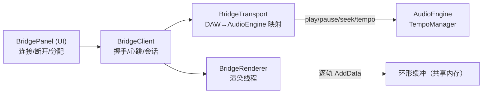

# TuneLab VST Bridge 模式计划书

> 以 VST3 插件（VSTi3）形式接入 DAW 的音频桥接方案：逐轨多通道输出、自由分配、传输（光标/曲速）跟随 DAW、手动连接/断开，直接在 DAW 内混音与导出。
>
> 版本：v0.1（草案） · 日期：2026-08-08

---

## 1. 背景与目标

### 1.1 现状

TuneLab 是独立的 .NET 8 / Avalonia 桌面应用：

- 音频由 `TuneLab/Audio/AudioEngine.cs` 驱动：`AudioSampleProvider.Read()`（SDL 实时回调）→ `AudioGraph.MixData()` 把所有轨道混成立体声主输出；
- 每轨渲染依赖 `Track`（`TuneLab/Data/Track.cs`）挂到 `AudioGraph`，`MidiPart` 的合成产物（`SynthesizedSegments`）与 `AudioPart` 的音频解码片段按绝对时间对齐（`AudioGraph.AddData`）；
- 传输：`AudioEngine.Play()/Pause()/Seek(time)`、`CurrentTime`、`ProgressChanged`；编辑器播放头 `IPlayhead.Pos`（tick）经 `TempoManager.GetTime/GetTick` 与秒互相换算（`MusicTheory.RESOLUTION = 480`）。

**痛点**：TuneLab 的成品无法进入 DAW 参与混音/母带/导出；要混音只能靠 TuneLab 自己的逐轨导出（`ExportTrack`/`ExportMaster`），再手动搬进 DAW，链路割裂、来回迭代成本高。

### 1.2 目标

1. 提供一个 **VST3 乐器插件（VSTi3）**，在 DAW 中加载后作为"TuneLab 的音频桥"；
2. 插件输出 **多通道**：输出总线数随 TuneLab 添加的轨道数增长（每个轨道默认一条立体声总线）；
3. **自由分配**：轨道 ↔ 输出总线/通道可手动任意指派，不强制按顺序；
4. **传输跟随 DAW**：播放/暂停/定位（光标）、曲速、拍号等由 DAW 驱动，TuneLab 播放头与曲速随之同步；
5. **手动连接/断开**：TuneLab 与插件之间是显式会话，可随时连接/断开，互不影响启动顺序；
6. 最终让用户**直接在 DAW 里对 TuneLab 各轨混音、加效果、导出**。

### 1.3 非目标（v1 范围外）

- 不把 TuneLab 整体嵌入插件进程（不跨进程嵌入 Avalonia UI）；
- 不做 AAX / AU / LV2（本版仅 VST3，如需求所述）；
- 不做"DAW MIDI 输入驱动 TuneLab 音符"（那是另一条 feature，本版插件仅输出，不消费 MIDI）；
- 不做自动拉起进程（本版为手动连接；"插件侧一键拉起 TuneLab"列为可选增强）；
- 不做插件多实例互连（同一时刻一个 TuneLab 对一个插件会话）。

---

## 2. 术语

| 术语 | 含义 |
|---|---|
| Bridge（桥） | TuneLab 与 DAW 内 VST3 插件之间的双进程音频/传输通道 |
| Host 侧 | TuneLab 应用进程（.NET），渲染音频并推送 |
| Plugin 侧 | DAW 内加载的原生 VST3 插件（C++），从共享内存拉音频、转发传输 |
| 控制块 | 共享内存中的连接状态/传输/轨道表等控制数据 |
| 音频环 | 每轨一个"按绝对采样位置寻址"的环形缓冲（见 6.2） |

---

## 3. 关键约束（来自现有代码）

- **TuneLab 是托管应用，VST3 是原生 C++**：不能把 TuneLab 直接编译成 VST3，必须是**双进程桥**。已有 P/Invoke 先例（`TuneLab/Audio/SDL2/SDLGlobal.cs`），`TuneLab.csproj` 已开 `AllowUnsafeBlocks`，共享内存映射（`MemoryMappedFile`）在 .NET 8 开箱即用。
- **音频目前是立体声模型**：`IAudioData` 只有 `GetLeft/GetRight`；`AudioGraph.AddData(track,…)` 已经能按轨（含轨音量/声像/静音/独奏）渲染单轨立体声 —— **桥接可逐轨复用 `AddData`**，无需改造合成管线。
- **传输是 tick 制**：`TempoManager` 快照（`TempoSnapshot`）做 tick↔秒换算，任何曲速变更都会使合成产物失效重建（`MidiPart` 已订阅时基变更）。→ "曲速跟随 DAW" 可复用这套失效机制。
- **实时性**：插件 `process()` 回调是实时线程，绝不能加锁/分配/GC；TuneLab 的合成本身非实时安全。→ 必须用"提前渲染 + 环形缓冲"的 push/pull 模型，而不是在插件回调里同步请求渲染。
- **现成第三方**：
  - `THIRD_PARTY/JUCE`：**JUCE v9**，**插件本体与插件界面（编辑器）基于 JUCE 构建**——`juce_audio_plugin_client`（VST3 包装）、`juce_audio_processors`（`AudioProcessor` 多总线 / `AudioProcessorEditor` 插件界面 / `AudioPlayHead` 传输）、`juce_audio_processors_headless`（无头测试宿主）、`examples/Plugins`（AudioPluginHost 参考宿主）。
  - `THIRD_PARTY/vst3sdk`：Steinberg **VST3 SDK 3.8.0**（`kVstVersionString "VST 3.8.0"`）——JUCE 的 VST3 包装层底层实现的正是该协议，作为**总线/传输接口语义的对拍参考**；其 `public.sdk/source/vst/hosting` 可作独立交叉验证宿主。

---

## 4. 总体架构

```mermaid
flowchart LR
    subgraph DAW 进程
        Host["DAW 宿主"]
        PLUGIN["Bridge_VST3.vst3<br/>(C++, JUCE)"]
        Host <-->|VST3 IAudioProcessor<br/>process() / ProcessContext| PLUGIN
        BUS1["输出总线 1 (轨A 立体声)"]
        BUS2["输出总线 2 (轨B 立体声)"]
        BUSn["输出总线 n (轨X 立体声)"]
        PLUGIN --> BUS1 & BUS2 & BUSn
    end

    subgraph TuneLab 进程
        TL["TuneLab (C#/.NET)"]
        RENDER["桥渲染线程<br/>逐轨 AddData → 环形缓冲"]
        CTRL["桥控制<br/>连接/分配/传输"]
        TL --> RENDER
        TL --> CTRL
    end

    PLUGIN <-->|"共享内存：控制块 + 每轨音频环"| CTRL
    RENDER -->|"每轨立体声数据"| PLUGIN
```

**核心思路（Rewire 式双进程桥）**：

1. DAW 加载插件 → 插件在共享内存建立**控制块**（命名会话），等待 TuneLab 手动连接；
2. TuneLab 连接后，插件把每个 `process()` 收到的 **ProcessContext（播放状态、采样位置、曲速、拍号、PPQ）** 写进控制块；
3. TuneLab 的**桥渲染线程**跟随 DAW 位置**提前渲染**（逐轨 `AudioGraph.AddData`），把各轨立体声推入各自的**按位置寻址的环形缓冲**；
4. 插件在实时回调里按当前 DAW 采样位置从环形缓冲**拉取**并填入各输出总线；把渲染提前量上报 `getLatencySamples()` 供 DAW 补偿；
5. TuneLab 播放头/曲速跟随控制块中的 DAW 传输（见 6.5），断开连接即回退到本地模式。

---

## 5. 关键技术决策

### 5.1 插件实现选型：基于 JUCE 构建（含插件界面），VST3 SDK 作对拍参考

**插件本体与插件界面统一基于 JUCE 构建**：`juce_add_plugin` 一键产出 VST3，插件界面直接用 `AudioProcessorEditor`（用户要求）；VST3 SDK 作为 JUCE 包装层底层协议的参考与交叉验证。

| 维度 | 方案（JUCE） |
|---|---|
| 产出 | 经 `juce_audio_plugin_client` 包装的 `.vst3`（VST3 3.8.0） |
| 处理器 | `juce::AudioProcessor`：`prepareToPlay` / `processBlock` / `getLatencySamples` / `getPlayHead` |
| 动态多总线 | `BusesProperties` + `setBusesLayout` 现成，轨数增减时激活/停用总线 |
| 插件界面 | **`juce::AudioProcessorEditor`（即用户指定的 JUCE 界面）**：连接/断开、会话 id、轨道→总线分配、状态指示 |
| 无头测试 | `juce_audio_processors_headless` + `UnitTestRunner` 可直接加载本插件做音频断言 |
| 依赖体积 | 链整个 JUCE（本插件无 DSP，代价可控；界面需求使 JUCE 成为必要） |
| 实时线程要求 | `processBlock` 内零锁零分配（环形缓冲无锁拉取） |

**结论**：插件本体无 DSP（只是"拉环形缓冲 + 转发传输"），JUCE 的额外体积换取的是**现成的 VST3 包装 + 动态多总线 + 插件界面**，正好覆盖全部需求；VST3 SDK 保留为对拍参考（`juce_audio_plugin_client_VST3.cpp` 与 `pluginterfaces/vst/*` 核对总线/传输语义），其 `public.sdk/source/vst/hosting` 作独立交叉验证宿主。

### 5.2 音频传输模型：push-ahead + 按位置寻址环形缓冲

- **不做**同步拉取（TuneLab 渲染非实时安全，会在 DAW 回调里卡顿/爆音）；
- **做**：TuneLab 渲染线程把每轨立体声**提前写入**一个容量可容纳数秒的环形缓冲；插件按**绝对 DAW 采样位置**寻址读取。
- 环形缓冲不是普通滚动队列，而是**按绝对采样位置索引的滑窗**（每个缓冲槽的地址 = 全局采样位置）：跳转（seek）时读者直接跳到新位置读，写者追着补；曲速变化/位置跳变天然正确处理，无需逐样本重同步。
- 读不到（下溢）输出静音并计数，写者以此校准提前量。

### 5.3 共享内存通道（Windows 优先）

- **命名文件映射（`CreateFileMapping` / .NET `MemoryMappedFile`）** + 命名事件（互斥写控制块、音频环用无锁 SPSC 原子读写指针）；
- 会话命名：`Local\TuneLab.Bridge.<session-id>`，session-id 由用户在桥面板填写/默认生成，避免多 DAW 实例串扰；
- 控制块与音频环**同一映射文件内布局**，一次映射完成。

---

## 6. 详细设计

### 6.1 共享内存协议

**协议头（控制块）**，C 侧定义一份，C# 侧用 `[StructLayout]` 镜像，两者由布局一致性单测守护（见 9.2）：

```c
#define TL_BRIDGE_MAGIC      0x544C4252 /* "TLBR" */
#define TL_BRIDGE_VERSION    1
#define TL_BRIDGE_MAX_TRACKS 64          /* 输出立体声总线数上限 */
#define TL_BRIDGE_RING_SAMPLES (8 * 48000) /* 每轨环容量：8s @ 48k */

struct TLBridgeControl {
    uint32_t magic;          /* 魔数 + 版本校验 */
    uint32_t version;
    uint32_t connected;      /* 握手后置 1 */
    uint32_t protocolMode;   /* 0=本地 1=桥接 */

    /* —— 传输（Plugin → TuneLab，每个 process() 更新） —— */
    uint64_t samplePos;      /* DAW 绝对采样位置 */
    uint64_t state;          /* VST ProcessContext.state 位标志 */
    double   tempo;          /* DAW 当前 BPM */
    int32_t  timeSigNum;     /* 拍号 */
    int32_t  timeSigDen;
    double   ppqPosition;          /* 以 DAW PPQ 表示的位置 */
    double   ppqOfLastBarStart;

    /* —— 音频配置（Plugin → TuneLab） —— */
    uint32_t sampleRate;
    uint32_t blockSize;
    uint32_t activeBuses;    /* 实际启用的输出总线数 */
    uint32_t latencySamples; /* 上报给 DAW 的提前量 */

    /* —— 轨道表（双向） —— */
    struct TLBridgeTrack {
        char     name[64];   /* 轨道名（显示用） */
        uint32_t enabled;    /* 该轨是否输出 */
        uint32_t busIndex;   /* 自由分配：本轨 → 第几条输出总线 */
        uint32_t followGainPan; /* 1=带轨音量/声像（默认） 0=原始信号交 DAW 推子 */
        uint32_t mirrorMuteSolo; /* 是否把 TuneLab 静音/独奏镜像到 DAW（见 6.6） */
    } tracks[TL_BRIDGE_MAX_TRACKS];

    /* —— 握手/心跳 —— */
    uint64_t hostTick;       /* 两侧各自心跳计数，超时判断开 */
    uint32_t status;         /* 错误码（协议不符/采样率冲突等） */
};
```

**握手与生命周期**：

1. 插件加载 → 创建映射 + 控制块（`connected=0`）→ 进入"等待 TuneLab"；
2. TuneLab 桥面板点**连接** → 打开同名映射，校验 magic/version → 置 `connected=1`，写入本侧信息，开始心跳；
3. 任一侧主动**断开**（按钮/进程退出/心跳超时）→ `connected=0`，TuneLab 回本地模式，插件输出静音并保留会话等待重连；
4. 两侧都心跳保活；断连后**不销毁映射**（插件在 DAW 里常驻），TuneLab 可再次连接。

### 6.2 音频传输（每轨环形缓冲）

- 每轨一条立体声环（`TL_BRIDGE_MAX_TRACKS` 条），容量 `8s`（可配），布局为交错 float32（L/R）以贴合 `AudioBusBuffers`；
- **写者（TuneLab 渲染线程）**：
  - 目标位置 = `samplePos`（控制块）+ 提前量（默认 ~200–500 ms，可调）；
  - 每块用 `AudioGraph.AddData(track, pos, end, true, buf, 0)` 渲染**单轨**立体声（复用现有逐轨渲染，含音量/声像/静音/独奏逻辑）；
  - 写完推进写指针，把当前已写到的位置写回控制块（供插件端算下溢/校准）；
  - 提前量变化时同步更新控制块 `latencySamples`（供 DAW 补偿）。
- **读者（插件 process()）**：
  - 纯无锁：原子读读指针/写指针，只做 memcpy + 静音填充，零分配零锁；
  - `process()` 每块读取 `[samplePos, samplePos+numSamples)`；未就绪样本填 0；
  - 下溢计数写回控制块（调试/诊断用）。

### 6.3 VST3 插件设计（插件工程 `Bridge_VST3/` → 产物 `Bridge_VST3.vst3`，基于 JUCE）

基于 **JUCE** 构建：`juce_add_plugin`（CMake，`PLUGIN_TYPE VST3` + `IS_SYNTH TRUE`）→ `juce::AudioProcessor` 子类 + `AudioProcessorEditor` 插件界面。

- **类别**：`IS_SYNTH TRUE` → VSTi3（乐器），**无 MIDI 输入**（可选留一条未用 MIDI 输入总线以兼容个别 DAW 对乐器轨的强制要求）；
- **输出总线**：`BusesProperties().withOutput("Track 1", AudioChannelSet::stereo(), /*isOptional*/ true)` × `TL_BRIDGE_MAX_TRACKS`；运行时按 `activeBuses` 用 `setBusesLayout`/总线 `setEnabled` 激活/停用（"取决于添加了多少轨"）——DAW 里表现为可插接 n 条立体声通道；
- **`processBlock()`**：读控制块 → 拉各激活总线音频 → 填各总线缓冲；同步把 `AudioPlayHead::Position`（`getIsPlaying`/`getTimeInSamples`/`getBpm`/`getTimeSigNumerator`/`getPpqPosition`/`getPpqPositionOfLastBarStart`）写入控制块（一次性 memcpy 整块，避免逐字段撕裂）；
- **`getLatencySamples()`**：返回当前提前量；
- **插件界面（`AudioProcessorEditor`，即用户指定的 JUCE 界面）**：
  - 状态指示：`等待 TuneLab / 已连接（采样率 / 块 / 轨数）/ 已断开`；
  - 控件：`Session Id` 输入框、`连接 / 断开` 按钮、总线/轨道列表（只读展示，分配以 TuneLab 桥面板为主）、错误提示；
  - 同步暴露少量参数（`Connect` 0/1 等）以支持 DAW 自动化/快照；
- **实时安全**：`processBlock` 内零分配、零锁（环形缓冲读指针为原子 64 位）；打开/关闭映射、UI 参数变更等一律在非实时路径（编辑器线程/总线 `setEnabled`）完成。

### 6.4 TuneLab 宿主侧设计（新增根级工程 `TuneLab.Bridge/`，遵循 `TuneLab.<子系统>` 命名）



- **`BridgeClient`**：打开 `MemoryMappedFile`，握手、心跳、断连清理；暴露 `Connected` 状态（可绑定 UI）；
- **`BridgeTransport`**：把控制块的 DAW 传输翻译给 `AudioEngine`：
  - `state & kPlaying` → `AudioEngine.Play()/Pause()`；
  - `samplePos` → `AudioEngine.Seek(seconds)`（`seconds = samplePos / sampleRate`），播放头经既有 `ProgressChanged → PlayheadForProject` 路径自动跟随（**光标跟随 DAW** 零改动）；
  - 曲速/拍号 → 见 6.5 的**时基覆盖**；
  - 采样率：跟随 DAW（`AudioEngine.SampleRate` 与 `AudioGraph.SampleRate` 联动，合成自动重建，复用现有 `OnSampleRateModified` 机制）；
- **`BridgeRenderer`**：独立渲染线程，按 6.2 的 push-ahead 模型逐轨 `AudioGraph.AddData` → 写共享环；桥接模式下**停用 SDL 输出**（`AudioEngine` 的播放处理器不启动/静默），避免双份出声；
- **`BridgePanel`（UI）**：桥接面板，见 6.7/6.8。

**TuneLab 侧最小改造点**：

1. `AudioEngine` 增加"桥接输出"分支：桥模式下 `Read()` 不再喂 SDL，而由 `BridgeRenderer` 直接消费 `AudioGraph`；播放状态与位置改由 `BridgeTransport` 驱动（其余不变）；
2. `TempoManager` 支持"会话时基覆盖"（见 6.5）；
3. 新增根级工程 `TuneLab.Bridge/`（`TuneLab.Bridge.csproj`，命名空间 `TuneLab.Bridge`，加入 `TuneLab.sln` 并由 `TuneLab` 工程引用，与 `TuneLab.GUI`/`TuneLab.I18N` 同构）+ 面板入口（菜单/工具栏），i18n 按仓库惯例在 `zh-CN.toml` 补段。

### 6.5 传输跟随（曲速/光标/拍号）

- **主从关系**：桥接模式下 **DAW 是 master**。`ppqPosition` 与 `tempo` 来自 DAW，TuneLab 不按自己的曲速表走；
- **时基覆盖**：给 `TempoManager` 装一个可插拔的"会话时基"（`ITempoManager` 包装或内部覆盖点）：`GetTime(tick)` / `GetTick(time)` 按 **DAW tempo + PPQ 基准**换算（`ppqOfLastBarStart` + 拍号用于小节对齐）；覆盖期间工程曲速表不变（只是不参与换算），断开即还原；
- **曲速变化**：DAW 变速 → 控制块 `tempo` 变化 → 时基覆盖更新 → 既有 `Modified` 失效机制触发合成产物重建（`MidiPart` 已订阅时基变更），与本地改曲速同路径，风险可控；
- **定位（seek）**：DAW 拖动播放头 → `samplePos`/`ppqPosition` 跳变 → `BridgeTransport.Seek` → 渲染线程立刻改写到新位置（按位置寻址环天然支持）；
- **循环/停止**：`state` 位（`kCycleActive`/`kPlaying`）透传；TuneLab 本地只反映播放/停止与位置，不自行循环。

### 6.6 轨道 → 通道分配（多通道 + 自由分配）

- **默认**：按轨道顺序自动指派 `track[i] → bus[i]`（"取决于添加了多少轨"：加了 3 轨 = 3 条立体声总线）；
- **自由分配**：桥面板每个轨道一个 `busIndex` 下拉（0..`TL_BRIDGE_MAX_TRACKS-1`），可任意互换/错位指派；多轨指到同一总线时叠加（可当分组总线用）；
- **增删轨**：轨道表随工程实时同步（订阅工程轨道增删事件），插件按 `activeBuses` 激活/停用总线，DAW 侧通道数实时变化；
- **静音/独奏/音量/声像**：
  - `followGainPan=1`（默认）：`AudioGraph.AddData` 已含轨音量/声像/静音/独奏，**所见即所得**；
  - `followGainPan=0`：输出原始信号（不加音量/声像），把控制权完全交给 DAW 推子/声像（配合混音导出最常用）；
  - `mirrorMuteSolo`：把 TuneLab 的静音/独奏镜像成总线静音（可选，默认关）。
- **主输出**（可选增强）：预留 `bus[0]` 可切"Master 全混"模式（等同现在 `MixData` 的整混输出），快速试用用。

### 6.7 连接 / 断开（手动）

- **桥面板**（TuneLab 内）：
  - `Session Id` 输入框（默认生成，跨实例唯一）；
  - `连接 / 断开` 按钮（互斥，禁用态随状态切换）；
  - 状态指示：`等待插件 / 已连接（采样率 xx kHz，块 xx，轨数 n）/ 已断开`，含错误提示（协议版本不符、会话被占用等）；
  - 面板另含轨道分配表与选项（6.6）。
- **插件侧**：编辑器状态页显示"等待 TuneLab 连接 / 已连接"，也可用 `Connect` 参数在 DAW 内（含自动化/快照）控制。
- **断开语义**：任一侧断开 → 另一侧 1s 内感知（心跳）→ 安全降级（TuneLab 回本地模式、插件输出静音）；重连无需重启任何进程。

### 6.8 DAW 端混音导出工作流（目标体验）

1. DAW 新建乐器轨，加载 `Bridge_VST3.vst3`，可创建 n 条音频轨分别路由到插件的第 1..n 条立体声输出；
2. 打开 TuneLab → 桥面板 → 连接 → 各轨音频实时流入对应 DAW 通道；
3. DAW 里对每条轨道混音/加效果/自动化 → 走 DAW 常规导出（在线或离线冻结）即成片；
4. 无需在 TuneLab 里做任何导出，改完即听、即混、即出。

---

## 7. 模块与文件布局（建议）

```
Bridge/                                  # 仓库根新增，独立于 .sln（原生侧不走 dotnet）
  protocol/TLBridgeProtocol.h            # 共享协议唯一真源（C 头）
Bridge_VST3/                             # 插件项目（JUCE 工程：juce_add_plugin，VST3 + IS_SYNTH）
  CMakeLists.txt                         # 链 THIRD_PARTY/JUCE；产物 Bridge_VST3.vst3
  Source/
    BridgeVST3Processor.h/.cpp           # juce::AudioProcessor（总线/processBlock/latency）
    BridgeVST3Editor.h/.cpp              # juce::AudioProcessorEditor（插件界面：连接/状态/分配）
    BridgeVST3Shared.h/.cpp              # 共享内存/环形缓冲封装（进程侧）
TuneLab.Bridge/                          # 根级新工程（命名遵循 TuneLab.<子系统>，同 TuneLab.GUI 等）
  TuneLab.Bridge.csproj                  # 加入 TuneLab.sln，由 TuneLab 工程引用
  BridgeClient.cs                        # 握手/心跳/会话
  BridgeTransport.cs                     # DAW 传输 → AudioEngine/TempoManager
  BridgeRenderer.cs                      # push-ahead 渲染线程
  BridgeProtocol.cs                      # 控制块 C# 镜像（[StructLayout]）
  BridgePanel.axaml / .cs                # 桥面板 UI（分配表 + 连接控制）
  BridgeRingBuffer.cs                    # 共享环读写（与 native 对齐）
tests/TuneLab.Tests/Bridge/              # 协议/换算/环缓冲单测（见 9）
```

协议真源放在 `Bridge/protocol/TLBridgeProtocol.h`，C# 镜像（`TuneLab.Bridge/BridgeProtocol.cs`）由**布局一致性测试**守护（9.2），避免两侧手改漂移。

---

## 8. 里程碑

| 阶段 | 内容 | 验收标准 |
|---|---|---|
| **M0 协议与骨架** | 共享内存协议 v1、两侧骨架、握手/心跳/手动连接断开、桥面板状态 UI、`vst3` 空壳可被 DAW 识别加载 | DAW 能加载插件并显示"等待连接"；TuneLab 连接/断开状态正确切换；协议不符被拒绝并提示 |
| **M1 音频链路** | 每轨环形缓冲、渲染线程、插件拉取填总线、采样率协商、`getLatencySamples` 上报 | DAW 中听到 TuneLab 音频（整混或逐轨），无爆音，跳转静默正确；逐轨总线数与轨道数一致 |
| **M2 传输同步** | play/pause/seek/循环透传、**曲速/拍号跟随**（时基覆盖）、播放头光标跟随 DAW | DAW 播放/暂停/拖动播放头，TuneLab 光标同步；DAW 变速 TuneLab 跟速；离线导出与在线一致 |
| **M3 分配与连接管理** | 轨道→总线自由分配 UI、`followGainPan`/`mirrorMuteSolo` 选项、增删轨实时同步、插件编辑器状态页 | 任意指派/互换总线在 DAW 端正确；加/删轨 DAW 通道数实时变化；断开重连无残留 |
| **M4 打磨与验证** | 断连/崩溃恢复、采样率热切换、工程切换、多 DAW 兼容、延迟调优、性能与稳定性、文档 | 断连任一侧无卡死；DAW 采样率切换后正常；连续长时间播放无下溢增长；README/AGENTS 补桥接用法 |

---

## 9. 测试与验证

### 9.1 单元测试（TuneLab.Tests 既有框架）

- 协议：C# 镜像结构 `Marshal.OffsetOf` 与 golden（由 native 侧头生成）逐字段比对；
- 时基覆盖：`GetTime/GetTick` 在 DAW tempo/PPQ 下正确、拍号变化正确、还原后回退；
- 环形缓冲：写读指针推进、绕回、下溢静音、seek 跳跃读写正确；
- `BridgeTransport`：模拟 ProcessContext 序列 → `AudioEngine` 状态/位置断言。

### 9.2 原生侧验证

- **无头宿主（主力）**：插件基于 JUCE，直接用 `juce_audio_processors_headless` + `UnitTestRunner` 加载本插件：假写者喂共享环 + 假 `AudioPlayHead`，断言各输出总线音频/传输字段正确；
- **交叉验证**：基于 `THIRD_PARTY/vst3sdk/public.sdk/source/vst/hosting`（`hostclasses`/`plugprovider`/`module`）写一个最小独立宿主加载产出的 `.vst3`，核对 JUCE 包装层的总线/`ProcessContext` 语义与协议一致；
- **参考宿主**：JUCE `examples/Plugins`（AudioPluginHost）与真实 DAW（如 Reaper）做手工冒烟：逐轨路由、变速、定位、离线导出对比。

### 9.3 集成/压力

- 长时间连续播放下溢计数不增长；高频 seek；DAW 采样率 44.1k↔48k 热切换；连接中 TuneLab 崩溃/DAW 崩溃的健壮性；
- 性能：渲染线程 CPU 占用、插件 process() 时延（应远低于块长）。

---

## 10. 风险与对策

| 风险 | 影响 | 对策 |
|---|---|---|
| 跨进程采样级同步（位置漂移） | 长播放后 DAW 与 TuneLab 错位 | 以 DAW `samplePos` 为唯一时间源、按位置寻址环、周期心跳校准、上报 latency 由 DAW 补偿 |
| 插件实时线程违规（锁/分配） | 爆音/卡死 | 环形缓冲无锁 SPSC；映射/参数变更全部放非实时路径；code review + 压力测试 |
| 曲速跟随引发合成重建抖动 | 变速瞬间卡顿 | 复用既有 tick 时基失效机制；渲染线程提前量吸收重建耗时；必要时限制变速采样频率 |
| 协议漂移（C 头与 C# 镜像不一致） | 静默错乱 | 布局一致性单测 + 版本号强校验 + 握手拒绝 |
| 动态总线的 DAW 兼容性差异 | 部分 DAW 通道数不刷新 | 固定最大总线数 + 可选激活，先测主流 DAW；必要时提供"固定 64 通道"兼容模式 |
| Windows 专属实现（文件映射） | 跨平台受限 | v1 只做 Windows（与现有 SDL/NAudio 输出一致）；协议层留 POSIX shm 抽象 |
| 双进程会话被占用/多开 | 连错实例 | session-id 命名空间 + 占用检测 + 明确报错 |

---

## 11. 开放问题（需确认）

1. **曲速语义**：桥接时 DAW 曲速**覆盖**工程曲速（推荐，满足"曲速跟随 DAW"），但若 DAW 曲速与工程不一致，合成音高/时长会按 DAW 曲速重建——是否接受？还是桥接时仅光标跟随、音频仍按工程曲速？（影响 6.5 设计，需与维护者确认）
2. **轨输出默认是否带音量/声像**（`followGainPan` 默认值）：所见即所得 vs 交 DAW 推子，v1 默认给哪个？
3. **最大轨数/总线数**：`TL_BRIDGE_MAX_TRACKS = 64` 是否够？是否要做"每轨可配多通道（非立体声）"（当前模型是立体声，多通道指多总线）？
4. **是否要"插件一键拉起/附加到 TuneLab"**（本版手动连接，自动拉起列增强）。
5. 是否需要 **主输出（Master 全混）总线**作为快速试用入口（6.6 可选增强）。
6. 桥面板入口放在菜单还是工具栏；是否要随工程保存会话 id 与分配表（建议随 `Settings` 保存会话偏好、分配表随工程保存）。

---

## 12. M0 实施状态（2026-08-08，已完成）

M0「协议与骨架」已实施并验证，对应第 8 节里程碑表格的 M0 行。

**已交付：**

| 位置 | 内容 |
|---|---|
| `Bridge/protocol/TLBridgeProtocol.h` | 共享协议唯一真源（魔数/版本/错误码/控制块布局偏移/心跳常量） |
| `TuneLab.Bridge/` | 宿主侧新工程：`BridgeProtocol.cs`（C# 镜像）、`BridgeClient.cs`（握手/心跳/连接生命周期）、`BridgePanel.axaml(.cs)`（桥面板 UI） |
| `Bridge_VST3/` | JUCE v9 插件工程：`CMakeLists.txt` + `Source/`（Processor/Editor/Shared 共享内存） |
| `TuneLab/UI/MainWindow/Editor/Editor.cs` | 顶部新增「Bridge」菜单 → 桥接面板 |
| `TuneLab/Resources/Translations/zh-CN.toml` | `[Menu]` 补 Bridge 条目、新增 `[BridgePanel]` 段 |
| `tests/TuneLab.Tests/Bridge/` | `BridgeProtocolLayoutTests`（对照头文件守护布局）+ `BridgeClientHandshakeTests`（进程内 FakePlugin 模拟插件侧） |
| 工程接线 | `TuneLab.sln` / `TuneLab.csproj` / `TuneLab.GUI.csproj` / `TuneLab.I18N.csproj` / `TuneLab.Tests.csproj`（InternalsVisibleTo + ProjectReference） |

**验证：**

- `dotnet build TuneLab.sln -c Debug` 全绿；`dotnet test` 249 全过（含 9 个 Bridge 单测：布局一致性 ×3、握手/心跳 ×6）。
- `Bridge_VST3.vst3`（Debug，约 25MB）编译成功，`moduleinfo.json` 类别 = `Instrument/Synth`、厂商 = `TuneLab`、SDK = VST 3.8.0。

**原生构建命令（Windows，MSVC+Ninja）：**

```powershell
cmd /c "call ""<VS>\VC\Auxiliary\Build\vcvars64.bat"" && cmake -S Bridge_VST3 -B build/Bridge_VST3 -G Ninja -DCMAKE_BUILD_TYPE=Debug && cmake --build build/Bridge_VST3"
# 产物：build/Bridge_VST3/Bridge_VST3_artefacts/Debug/VST3/Bridge_VST3.vst3
```

**手工验收路径（用户侧）：**

1. 把 `Bridge_VST3.vst3` 拷到 DAW 的 VST3 目录（如 `%CommonProgramFiles%\VST3`），DAW 扫描并加载 —— 插件应显示「Waiting for TuneLab...」；
2. 启动 TuneLab → 菜单「桥接 → 桥接面板...」→ 点「连接」—— 面板状态应变为「已连接」，插件界面切到「Connected」；
3. 点「断开」—— 两侧回到断开态；DAW 播放/暂停不应影响 TuneLab 本地模式（M0 尚未接管传输，属预期）。

**M0 已知限制/待办（进入 M1 前需注意）：**

- 仅 Windows（命名文件映射）；POSIX shm 待后续。
- 插件默认会话 id = `default`（编辑器侧暂不可改；M1/M3 补）。
- `process()` 只输出静音并写 DAW 采样率/块大小（M1 接入逐轨环形缓冲）。
- 输出总线已按 `TL_BRIDGE_MAX_TRACKS`(64) 声明为可选立体声、默认不激活（M3 按轨激活）。
- 断连后 `connected` 清零、`protocolError` 复位由宿主侧负责；插件侧心跳停滞由宿主超时检测兜底。

---

## 13. M1 实施状态（2026-08-08，已完成，待用户手工验收）

M1「音频链路」已实施，对应第 8 节里程碑表格的 M1 行。

**已交付：**

| 位置 | 内容 |
|---|---|
| `Bridge/protocol/TLBridgeProtocol.h` | 追加 `TLBridgeRing`（writePos/readPos/underflow，24B）+ 每总线环布局宏：`TL_BRIDGE_RING_SAMPLES=384000`、`TL_BRIDGE_RING_STATE_OFF`、`TL_BRIDGE_RING_DATA_OFF`、`TL_BRIDGE_TOTAL_SIZE`、`TL_BRIDGE_OFF_RING_STATE/DATA(bus)` |
| `TuneLab.Bridge/BridgeProtocol.cs` | C# 镜像补 `RingSamples/RingSize/RingOff*`、`RingStateStart/RingDataStart/RingDataBase/TotalSize` |
| `TuneLab.Bridge/BridgeRingBuffer.cs` | 宿主侧共享环 I/O：按绝对采样位置寻址、绕回分段写、`SetWritePos` 带 release 内存屏障 |
| `TuneLab.Bridge/IBridgeAudioProvider.cs` + `BridgeTrack.cs` | 宿主→TuneLab 的音频提供者契约（避免 `TuneLab.Bridge` 反向引用 `TuneLab` 的循环依赖）：轨道快照/逐轨渲染/静音独奏/采样率应用/桥接激活 |
| `TuneLab.Bridge/BridgeRenderer.cs` | 渲染线程：DAW 位置 + 200ms push-ahead 为目标、按 chunk 渲染写环、seek 重置、控制块写 `latencySamples`、轨道表刷新、采样率跟随 |
| `TuneLab.Bridge/BridgeClient.cs` | 映射尺寸扩到 `TotalSize`；暴露 `Accessor` 供渲染线程 |
| `TuneLab.Bridge/BridgePanel.axaml.cs` | `Open(..., provider)` 新签名；连接态启停 `BridgeRenderer` 并激活宿主桥接（SDL 静音），断开恢复 |
| `TuneLab/Audio/AudioEngine.cs` | `BridgeMode` 开关 + `Read()` 桥接态静音 + `GetTracksSnapshot()` + `MixBridgeData()` |
| `TuneLab/Audio/AudioGraph.cs` | `TracksSnapshot()`（加锁取数组） |
| `TuneLab/Audio/AudioBridgeProvider.cs` | 提供者实现：轨道→`BridgeTrack` 快照缓存、`FollowGainPan` 走 `AddData`/否则 raw 叠加、`SetBridgeActive`→`BridgeMode` |
| `TuneLab/UI/MainWindow/Editor/Editor.cs` | 桥面板调用传入 `AudioBridgeProvider.Instance` |
| `Bridge_VST3/Source/BridgeVST3Shared.h/.cpp` | 映射 `TL_BRIDGE_TOTAL_SIZE`；补实时安全访问器：`ringData/ringWritePos/ringSetReadPos/ringAddUnderflow/writeSamplePos/readLatencySamples`（`std::atomic` 自由函数） |
| `Bridge_VST3/Source/BridgeVST3Processor.h/.cpp` | 64 条输出总线默认激活；`prepareToPlay` 写 `activeBuses` 并 `setLatencySamples`；`processBlock` 逐总线从共享环拉 `[samplePos, samplePos+numSamples)` 填总线（下溢补 0 计数）；`timer` 跟随宿主延迟更新 `setLatencySamples` |
| `Bridge_VST3/Source/BridgeVST3Editor.cpp` | 状态页显示 DAW 采样率/块大小/激活总线；版本标注 M1 |
| `tests/TuneLab.Tests/Bridge/` | 布局测试补 `RingOffsetsMatchHeader`；新增 `BridgeRingBufferTests`（写发布/绕回/复位/总线不重叠）；`FakePlugin` 映射 `TotalSize` |

**验证：**

- `dotnet build TuneLab.sln -c Debug` 全绿；`dotnet test` **255 全过**（Bridge 新增 6：环布局 ×1、环形缓冲 ×5），legacy 兼容测试 10/10。
- `Bridge_VST3.vst3` 编译安装成功（`build/Bridge_VST3/Bridge_VST3_artefacts/Debug/VST3/`）。

**相对计划书的设计取舍（M1 落地时决策）：**

- **按"总线"而非"轨"建环**：`TL_BRIDGE_MAX_TRACKS` 条环，按 `busIndex` 索引；多轨可叠加到同一总线（M1 默认 `track[i]→bus[i]`，叠加能力已实现，M3 开放自由分配）。比"每轨一环 + 插件端映射"更贴合插件逐总线拉取、少一层映射。
- **64 条输出总线默认全激活**：保证 DAW 始终可见全部输出（空轨静音）；动态按轨激活/停用留待 M3（对应 10 节"固定最大总线数"风险对策）。
- **M1 保持 SDL 运行但静音**（`BridgeMode`）：避免设备重建/销毁复杂度；传输跟随（播放/暂停/seek 同步）属 M2。
- 环容量 `384000` 帧（8s@48k，字面量而非 `8*48000`，因布局测试正则不解析算术式）。

**待用户手工验收（对应 8 节 M1 验收标准）：**

1. `Bridge_VST3.vst3` 拷入 DAW VST3 目录并加载；TuneLab 桥面板「连接」。
2. DAW 中确认可听到 TuneLab 音频（Track 1..N 对应总线 1..N，可逐轨路由/静音验证）；播放/暂停/拖动跳转时无爆音、跳转处静音正确。
3. 桥接期间 TuneLab 本地输出静音（不双声）；断开后恢复本地模式。
4. 采样率：DAW 44.1k/48k 下 TuneLab 渲染正确对齐。

---

## 14. M2 传输同步实施状态（2026-08-08，已完成，待用户手工验收）

M2「传输同步」已实施，对应第 8 节里程碑表格的 M2 行。DAW 为 master，TuneLab 跟随：播放/暂停/播放头位置/曲速逐项透传；拍号暂不驱动 UI（仅透传字段），循环沿用 DAW 本地行为。

**已交付：**

| 位置 | 内容 |
|---|---|
| `Bridge/protocol/TLBridgeProtocol.h` + `TuneLab.Bridge/BridgeProtocol.cs` + 布局测试 | 控制块新增传输状态位：`TL_BRIDGE_STATE_PLAYING=0x1`、`TL_BRIDGE_STATE_LOOPING=0x2`（`Offset.State` 位标志，对应 VST `ProcessContext` 位）；C# 镜像 `StatePlaying/StateLooping`；布局测试断言两宏一致 |
| `Bridge_VST3/Source/BridgeVST3Shared.h` | 新增 `writeTransport(state, tempo, timeSigNum, timeSigDen, ppqPosition, ppqOfLastBarStart)`：一次写入控制块六个传输字段 |
| `Bridge_VST3/Source/BridgeVST3Processor.cpp` | `processBlock` 从 `AudioPlayHead` 取 `PositionInfo`：`getIsPlaying`→PLAYING、`getIsLooping`→LOOPING、`getBpm`→tempo、`getTimeSignature`→num/den、`getPpqPosition`→ppq、`getPpqPositionOfLastBarStart`→barStart；`writeSamplePos` + `writeTransport` 每块回写 |
| `TuneLab.Bridge/IBridgeAudioProvider.cs` | 新增三个传输回调：`SetTransportPlaying(bool)`、`SetTransportSeek(double seconds)`、`SetTransportTempo(double? bpm)`（含 M2 注释） |
| `TuneLab.Bridge/BridgeTransport.cs`（新） | 渲染线程每轮 `Apply`：play/pause **边沿**检测透传；播放头位置 `samplePos/sampleRate`→秒，播放中按 50ms 间隔平滑跟随、>0.25s 跳变立即跟随，停止时仅跳变跟随；曲速 >0.5 BPM 变化触发覆盖、无效/0 清空覆盖（BPM 阈值防抖动，无时间节流） |
| `TuneLab.Bridge/BridgeRenderer.cs` | `RenderOnce` 内（读 `dawPos` 后）调 `mTransport.Apply(accessor, mProvider, sampleRate)` |
| `TuneLab/Audio/AudioBridgeProvider.cs` | 三个回调实现：一律 `Dispatcher.UIThread.Post`（与 `ApplySampleRate` 同范式，避免渲染线程触发 UI/合成）→ `AudioEngine.Play/Pause/Seek`；曲速覆盖遍历 `GetTracksSnapshot()` 命中 `Track.TempoManager` 调 `SetTimebaseOverride` |
| `TuneLab/Data/TempoManager.cs` | 会话时基覆盖：`TimebaseOverrideBpm` + `SetTimebaseOverride(double?)`（覆盖期恒定 DAW 曲速线性换算，工程曲速表不变，断开还原）；换算经 `Timebase` 属性路由，变更走 `Notify()`→`Modified` 触发既有重合成/UI 失效 |
| `TuneLab/Audio/AudioEngine.cs` | `OnProgressChanged` 桥接态直接 return（DAW 为 master，不自行越界暂停） |
| `tests/TuneLab.Tests/Bridge/BridgeTransportTests.cs`（新） | 进程内共享内存 + `FakeProvider`：play/pause 边沿（不重复通知）、播放中跳变跟随/小步进节流、停止时拖动跟随、曲速覆盖/清空/防抖 |
| `tests/TuneLab.Tests/TempoConvertTests.cs` | 追加时基覆盖用例：恒定曲速换算、断开还原、非法值（0/负/NaN）忽略 |

**验证：**

- `dotnet build TuneLab.sln -c Debug` 全绿（0 错误）；`dotnet test` **261 全过**（M1 255 + 新增 6：传输 ×4、时基覆盖 ×2）。
- `Bridge_VST3.vst3` 已重编（`ninja: no work to do`，含传输写入代码，输出 `build/Bridge_VST3/Bridge_VST3_artefacts/Debug/VST3/`）。

**相对计划书的设计取舍（M2 落地时决策）：**

- **曲速覆盖挂到工程 TempoManager 而非每轨**：DAW 是单一时间轴；任一图内轨的 `TempoManager` 即工程曲速表（多轨共享 `Project` 实例），命中即返回，空工程跳过。覆盖期恒定 DAW BPM 线性换算，**不改写工程曲速表**，断开即还原。
- **曲速只用 BPM 阈值（0.5）防抖，不做时间节流**：DAW 变速是离散操作，自动化连续小幅变化被阈值吸收；去掉时间节流使行为完全确定、可测。
- **拍号暂不透传为 UI 行为**：字段已随 `writeTransport` 透传，但 TuneLab 拍号在 MIDI 部件里按谱面走，M2 不做 DAW 拍号驱动（对应 8 节验收只列变速/变拍号两项，拍号跟随留待后续）。
- **停止时位置跟随仅限明显跳变**（>0.25s）：连上 DAW 停播瞬间播放头对齐一次，之后不随微扰重复 seek，避免无谓重合成。
- **播放中位置跟随 50ms 间隔 + 0.25s 跳变双重判据**：拖动播放头（大跳）即时对齐；正常播放逐 50ms 平滑推近（seek 本身幂等，重合成成本可接受）。

**待用户手工验收（对应 8 节 M2 验收标准）：**

1. DAW 播放 → TuneLab 编辑器播放头光标同步走动；暂停/继续 → 跟随。
2. DAW 拖动播放头（播放或停止态）→ TuneLab 光标跳到对应位置。
3. DAW 变速 → TuneLab 跟速（重合成按新曲速），光标 tick 映射一致。
4. 桥接态下 TuneLab 不再自行"播到尾自动暂停"（DAW 为 master）。
5. 断开桥接 → 时基覆盖还原工程曲速，本地模式不受影响。

### 14.1 M2 后续 Bug 修复（2026-08-08，待用户手工验收）

**① 曲速和 DAW 不同步（TuneLab 回落工程曲速表）：**

- 根因：DAW 停止/传输边界帧 `AudioPlayHead::getBpm()` 报 nullopt → 插件写 `tempo=0`；宿主 `BridgeTransport.Apply` 原逻辑在 `tempo=0` 时**清空时基覆盖** → TuneLab 瞬间回落工程曲速表（"曲速不同步"）+ 反复重合成。
- 修复：`BridgeTransport.cs` 去掉"清空覆盖"分支——连接期间 `tempo<=0` 视为"本帧未上报"，**保留上次有效曲速**；覆盖仅在断开时由 `StopRenderer` 统一 `SetTransportTempo(null)` 还原。
- 测试：`TempoOverride_AppliesAndRetainsLastValid`（原 `...AndClears` 改名）断言 `WriteTempo(0)` 后覆盖保留、新曲速继续应用。

**② 过桥接后关闭 TuneLab 有进程残留：**

- 根因：BridgePanel 是常驻第二窗口且"关闭即隐藏"（真正关闭只在应用退出时）；Avalonia 默认 `ShutdownMode.OnLastWindowClose` 意味着**关主窗口不触发退出**（桥接面板窗口仍在）→ 进程残留。
- 修复：`App.axaml.cs` 在设置 `desktop.MainWindow` 后显式 `desktop.ShutdownMode = Avalonia.Controls.ShutdownMode.OnMainWindowClose` → 关主窗口即退出 → `ShutdownRequested` 置 `mAllowClose` → 桥接面板关闭 → `Closed` 走 `StopRenderer`（停渲染器、`SetBridgeActive(false)`、`SetTransportTempo(null)` 还原曲速、`SetTransportPlaying(false)`）+ `mClient.Dispose()`。

**③ DAW 无声（插件输出恒静音，M1 遗留根因）：**

- 宿主日志证据：`Bridge renderer: ... bus0Write=91671 ... peak=0.2229/0.1652` ——宿主**确实**往环里渲染出了真实音频、连接/传输同步均正常，但 DAW 仍无声 → 断点锁定在插件输出侧。
- 根因：`BridgeVST3Processor.cpp` 里 `processBlock` 与 `prepareToPlay` 都用 **`getBusCount(true)`** 当输出总线数。JUCE 的 `getBusCount(bool isInput)` 参数是 **isInput**（`return isInput ? inputBuses : outputBuses;`），插件**没有任何输入总线** → 恒返回 0 → 逐总线拉环循环**一次都不执行** → `buffer.clear()` 后输出保持全静音。
- 修复：两处 `getBusCount(true)` → **`getBusCount(false)`**（输出总线）；`getChannelIndexInProcessBlockBuffer(false, bus, 0)` 对未分配通道返回 -1 已由 `continue` 兜底。
- 验证：插件重编成功并已部署到 `C:\Program Files\Common Files\VST3\Bridge_VST3.vst3`（时间戳 2026/8/9 00:17:29）。注意 cmake `--build` 的 POST_BUILD 安装步骤用 `copy_directory` 对已存在文件**不覆盖**——部署到 DAW 目录需用 `robocopy /E /IS /IT` 强制覆盖。

**④ 有声音但不连续（环回绕后 DAW 循环/回跳读到被覆盖旧数据）：**

- 宿主日志证据：`bus0Write=423808 advanced=False`（`423808 > RingSamples=384000`，环已回绕；宿主此后不再重写）→ DAW 循环回跳到 `[0,150000]`，其中 `dawPos ∈ [0, 423808-384000=39808)` 的环槽已被更新的绝对位置 `[384000,423808)` 音频覆盖 → 插件读到错位旧数据，每圈开头 ~0.83s 声音错乱。
- 根因：`BridgeRenderer.RenderOnce` 的 `if (writePos > target) continue;` 只判断"写位超前于目标"，**未判断读位是否已落入环回绕覆盖的区域**——环是滑窗，写位与读位间距超过环容量后旧数据必然被覆盖。
- 修复：渲染前计算有效起点 `validStart = writePos > RingSamples ? writePos - RingSamples : 0`；`dawPos < validStart` 时重置写位到 `dawPos` 重铺 `[dawPos, target)`（此时插件 `writePos >= needEnd` 检查保证要么读到新数据、要么补零，不会读半写状态）。非回绕的小幅回跳（`dawPos >= validStart`）仍复用旧数据，不重复渲染。
- 验证：宿主重编 + `dotnet test` 261 全过；宿主端生效需重启 TuneLab。

**⑤ 播放不全（开头音符缺失——连接/合成未就绪时被写成静音、写位越过后再不重写的永久空洞）：**

- 宿主日志证据（map16）：`map16=0.000,...,0.000,0.003,0.027,0.308,...`——环 `[0, ~0.3s]` 恒为 0，音频只存在于 `[~0.3s, 2.07s]`；`now`（DAW 当前位置窗口峰值）在 0.56s/1.31s/2.04s 非零、`[0,0.3s]` 恒 0 → 开头音符所在区域从连上起就一直是静音。
- 根因：宿主连接后、DAW 停在 0 时立即把 `[0, lead=200ms]` 渲染进环——但此刻合成尚未就绪，写进去的是静音；渲染线程只往 `writePos` 之后追加，**写位越过该区域后永不回头重写** → 合成完成后开头区域已永久空缺（TuneLab 自身播放正常因为它是合成完才播）。
- 修复：`BridgeRenderer.RenderOnce` 在 `writePos >= target`（已达成/超前）且 **DAW 未播放**时，周期性（每 32 轮 ≈ 160ms）整环回填 `[dawPos, writePos)`：只重写数据、不推进写位（`RenderBus(..., updateWritePos:false)`）→ 合成一完成，之前写成静音的区域自动补上。播放中不回填（避免与插件实时读竞态）。条件用 `>=` 覆盖"刚铺满领先窗"（全新环 writePos==target）与"已超前"两种状态。
- 验证：用户 DAW 实测 3 音符全部有声。

**⑥ DAW 调节 BPM 后 TuneLab 显示不变（时间轴 tempo 行只显示工程曲速表，覆盖不进 UI）：**

- 根因：时间轴 tempo 行（`TimelineView` 的 `TempoItem`）渲染的是 `TempoManager.Tempos`（工程曲速表 `mTempos`）；DAW 会话时基覆盖 `TimebaseOverrideBpm` 只作用于内部换算（合成），**全仓库无任何 UI 读取它**——因此无论 DAW BPM 怎么调，TuneLab 显示的 tempo 恒为工程值（内部合成其实已按 DAW 曲速同步）。
- 修复：`ITempoManager` 暴露只读 `double? TimebaseOverrideBpm`；`TimelineView` 新增带覆盖的 `BpmString/TempoWidth(ITempoManager, ITempo)`（`EffectiveBpm`：覆盖 `>0` 用覆盖、否则工程表），`TempoItem` 的 `Rect/Render` 改用双参版本 → 桥接激活时 tempo 行显示 DAW 恒定曲速，断连/覆盖为空自动还原。编辑输入仍走单参版本（改的是工程表，不受覆盖影响）。覆盖变更走 `Notify → Modified` 既有刷新链路。
- 诊断：渲染器诊断行新增 `tempo=`（宿主读共享内存插件上报曲速），用于确认插件是否持续上报。
- 验证：用户 DAW 实测 BPM 已同步显示。

**验证：** `dotnet build TuneLab.sln -c Debug` 0 错误；`dotnet test` **261 全过**（含改名的曲速保留用例）。宿主端已重编（TuneLab.exe 需重启生效）；插件因 ③ 已重编并部署（DAW 需重启加载新 dll）。⑤⑥ 用户 DAW 实测均已确认（3 音符全有声 + BPM 同步显示）。

---

## 附：参考资料位置

- **插件与插件界面（JUCE）**：`THIRD_PARTY/JUCE/modules/juce_audio_plugin_client/juce_audio_plugin_client_VST3.cpp`（VST3 包装/总线对拍）、`juce_audio_processors/`（`AudioProcessor`、`AudioProcessorEditor`、`AudioPlayHead`、`BusesProperties`/`setBusesLayout`）、`juce_audio_processors_headless/`（无头测试）、`THIRD_PARTY/JUCE/examples/Plugins/`（AudioPluginHost 参考宿主）、`THIRD_PARTY/JUCE/docs/`（CMake `juce_add_plugin` 用法）。
- **协议对拍参考（VST3 SDK）**：`THIRD_PARTY/vst3sdk/pluginterfaces/vst/`（`ivstaudioprocessor.h`、`ivstprocesscontext.h`、`ivsteditcontroller.h`、`ivstparameterchanges.h`）、`public.sdk/source/vst/hosting/`（独立交叉验证宿主）。
- TuneLab 现有接线点：`TuneLab/Audio/AudioEngine.cs`（`AudioSampleProvider`/`Play`/`Pause`/`Seek`/`SampleRate`）、`AudioGraph.cs`（`AddData`/`MixData`）、`TuneLab/Data/Track.cs`（`ExportEnabled`/`ExportChannels` 可复用为桥输出开关）、`TempoManager.cs`（时基快照）、`Editor.cs`（`PlayheadForProject` 光标跟随）。
