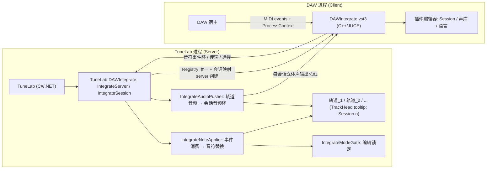
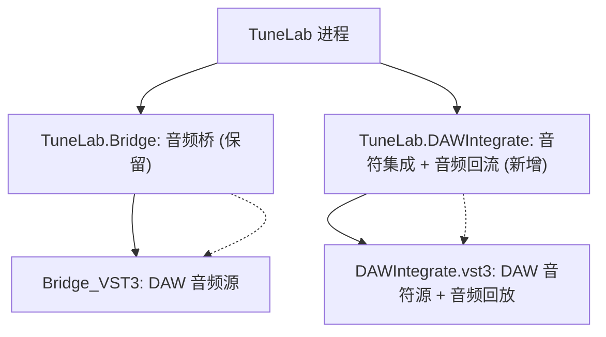

# TuneLab DAW Integrate 模式计划书

> 以独立 VST3 插件（VSTi3）作为 DAW 音符源，将 DAW 播放中的音符信息（音高/起止/力度）经 IPC 实时集成进 TuneLab，**同时把 TuneLab 渲染的轨道音频经同一 IPC 回流 DAW**（音符进、音频出闭环）：**TuneLab 为 IPC 服务端、插件为客户端**（与现有 Bridge 模式方向相反），新增 `TuneLab.DAWIntegrate` 模块，保留原 Bridge 模式不动。开启 Integrate 后，APP 内对应轨道的音符"音高/长度/增删"锁定，仅保留音高线、音素时长、声库参数曲线的编辑。
>
> 版本：v0.1（草案） · 日期：2026-08-30

---

## 1. 背景与目标

### 1.1 现状：Bridge 模式（已实现）

`VST-Bridge-计划书.md`（已落地为 `TuneLab.Bridge/` + `Bridge_VST3/`）解决的是"把 TuneLab 音频送进 DAW"：

- **结构**：`TuneLab.Bridge`（C#，被 `TuneLab` 引用）——`BridgeClient`（连接/握手/心跳）、`BridgeRenderer`（渲染线程、push-ahead）、`BridgeRingBuffer`（按绝对采样位置寻址的环）、`BridgeTransport`（传输跟随）、`BridgePanel`（手动连接面板）、`BridgeProtocol`（共享内存 C# 镜像）、`IBridgeAudioProvider`（由 `TuneLab/Audio/AudioBridgeProvider.cs` 实现）；
- **插件**：`Bridge_VST3`（JUCE v9 CMake：`juce_add_plugin`，VST3，`BridgeVST3Processor`/`BridgeVST3Editor`/`BridgeVST3Shared`），64 条立体声输出总线，实时回调从共享环拉音频；
- **共享内存**：`Local\TuneLab.Bridge.<session-id>`（插件**创建**映射 → TuneLab 打开，即"插件为 server、TuneLab 为 client"）；协议头 `Bridge/protocol/TLBridgeProtocol.h` 与 C# `BridgeProtocol.cs` 一一对应，由 `tests/TuneLab.Tests/Bridge/BridgeProtocolLayoutTests.cs` 守护偏移；
- **传输**：插件每 `process()` 用 `AudioPlayHead`（ProcessContext）写 `samplePos/state/tempo/timeSig/ppq`，TuneLab `BridgeTransport.Apply` → `AudioBridgeProvider`（`SetTransportPlaying/Seek/Tempo`，缓存在 `Dispatcher.UIThread.Post`），DAW 为 master；
- **音频**：`AudioEngine.BridgeMode` 开启时 SDL 输出静音，`BridgeRenderer` 把各轨 `AudioGraph.AddData` 结果提前渲染进环，插件按 DAW 位置拉取。

**痛点（本计划要解决的）**：Bridge 只搬运"音频"；用户仍须在 TuneLab 里**手动**照 DAW 编排音符（音高/时值），DAW 里的旋律改动无法回流。DAW Integrate 模式让 **DAW 的 MIDI 音符成为 TuneLab 的音符真源**：DAW 播到哪里，TuneLab 的音符就被替换成哪里，用户只负责演唱参数（音高线/音素时长/声库参数曲线）。

### 1.2 目标

1. 独立 VST3 插件 **DAW Integrate**（JUCE，与 Bridge_VST3 并列），**捕获 DAW 发给它的 MIDI 音符**（note-on/off），经命名共享内存实时上报；
2. **方向反转**：由 **TuneLab 创建/持有共享内存会话（server）**，插件打开并按会话号（client）接入；连接方式仍为显式 IPC 会话 + 心跳保活，保留与 Bridge 相同的"手动/自动、可断连"体验；
3. **一个插件实例 = APP 一条新轨道**：轨道名沿用 TuneLab 默认命名（`ProjectExtensions.NewTrack` → `"Track".Tr(TC.Document) + "_" + N`，zh-CN 即 **轨道_1 / 轨道_2 / …**）；不同插件实例用**不同会话编号（session number）**区分；
4. **插件编辑器显示当前 session**；APP **多轨界面（TrackHead）悬浮提示显示对应 session**；
5. **实时替换**：DAW 播放过程中，插件提供的音符信息（起止/音高）实时替换进 APP 对应轨道，**保留歌词**（Lyric/发音/钉死音素不丢）；
6. **音频回流 DAW**：会话激活时，TuneLab 把该轨道渲染出的立体声音频按 push-ahead 推入会话音频环，插件经**输出总线**实时拉取（`setLatencySamples` 补偿），实现 DAW 内"音符进来、声音回来"闭环；本地 SDL 输出此时静音（复用 `AudioEngine.BridgeMode` 语义），避免双路出声；
7. **编辑锁定**：开启 Integrate 的轨道，音符的**音高拖动/长度调整/新增/删除禁用**，**音高线（Pitch）、音素时长、声库参数曲线（Automation）仍可编辑**；
8. **插件可切换对应轨道的声库与语言**：声库列表与各声库支持语言**由 server 下发**（引擎可声明语言；未声明则 client 语言选择用**"默认"**占位）；
9. **模式互斥**：同一时刻 Integrate 与 Bridge **只能启用其一**；开启 Integrate 时若当前工程有未保存改动先**提示保存**，然后**新建一个没有任何轨道的空工程**作为 Integrate 工作区（轨道随后由各插件会话自动创建）；
10. 新增 `TuneLab.DAWIntegrate` 模块（与 `TuneLab.Bridge` 平级共存），**原 Bridge 模式不动**（仅互斥门禁）；
11. 插件编译产物直接放入 `C:\Program Files\Common Files\VST3\`。

### 1.3 非目标（v1 范围外）

- 不做逐轨**多总线**音频（v1 每会话固定 **1 条立体声输出总线** = 该轨道音频；同 Bridge 的 n 总线自由分配列为后续增强）；
- 不做逐音符歌词从 DAW 导入（歌词仍以 APP 内已有内容为准，DAW 音符只带音高/时值/力度）；
- 不做 AAX / AU / LV2（仅 VST3）；
- 不做多 DAW 同时连同一 TuneLab 实例的冲突仲裁（一个 session 号只允许一个插件实例接入）；
- 不做 DAW 侧插件一键拉起/关停 TuneLab（手动打开 Integrate 面板，后续增强）。
- 不做 Bridge 与 Integrate **同时启用**（强制互斥：UI 双门禁 + 宿主级单开关，见 5.9）；
- 不改 `TuneLab.SDK` / `TuneLab.Foundation` 的**已发布 ABI**：仅新增一个**可选接口** `IVoiceLanguageProvider`（加性新类型、不影响既有插件二进制，声明进 `PublicAPI.Unshipped.txt`）；声库/语言切换走宿主既有数据层 API，见 5.7。

---

## 2. 术语

| 术语 | 含义 |
|---|---|
| Integrate（集成） | DAW 音符 → TuneLab 音符的实时替换通道（区别于 Bridge 的音频通道） |
| Server 侧 | TuneLab 应用（.NET）：创建共享内存会话、持有音符/轨道状态 |
| Client 侧 | DAW 内的 **DAW Integrate VST3**（C++/JUCE）：打开会话、写传输/音符、读声库目录 |
| Session（会话） | 一个插件实例 ↔ 一条 APP 轨道的一对一命名共享内存通道，编号 `1..MaxSessions` |
| 注册表（Registry） | TuneLab 创建的**唯一**小映射：插件在此登记"我要接入会话 n"，server 据此延迟建会话映射 |
| 音符事件环 | 会话内锁-free SPSC 环形队列：插件实时线程写 note-on/off 事件，server 工作线程消费 |
| 音频环（Audio Ring） | 会话内 TuneLab→插件 的单条立体声环形缓冲（按绝对采样位置寻址，与 Bridge 同构） |
| 目录块（Catalog） | 会话内 server→plugin 的声库/语言目录（带 revision），插件编辑器读取展示 |

---

## 3. 关键约束（来自现有代码与仓库约定）

- **ABI 冻结**：`TuneLab.SDK`/`TuneLab.Foundation` 公共 API 由 `PublicAPI.Shipped.txt` 守护（RS0016/RS0017）。本计划**只新增一个可选 SDK 接口** `IVoiceLanguageProvider`（加性新类型，不破坏已发布 ABI；不必为既有插件补 DIM，声明进 `PublicAPI.Unshipped.txt`，并遵守 `docs/sdk-api-evolution.md` 的接口分类/演进规则）——声库切换走已有 `IMidiPart.SoundSource`（`SoundSourceInfo{Kind,Type,Id}`）、`PartVoiceController` 同款调用；语言由该接口按声库声明（未声明 → client 显示"默认"，见 5.7）。
- **TuneLab 是托管应用、插件是原生 C++**：只能双进程 IPC。已有 `MemoryMappedFile` 先例（`TuneLab.Bridge`），`AllowUnsafeBlocks` 已开。
- **实时线程约束**：插件 `process()` 是实时线程，禁锁/禁分配/禁系统调用；**server 侧合成本身非实时安全**。→ 音符事件用**无锁 SPSC 环形队列**；音频回流按 Bridge 的 push-ahead 环形缓冲（见 5.4）——两类通道都把"渲染/合成/建 note/改属性"放在 TuneLab 侧线程，插件实时回调只做无锁读写。
- **音符模型**：`IMidiPart.Notes`（`INote`：`Pos/Dur/Pitch/Lyric/Pronunciation`、`LeadingPhonemes/BodyPhonemes` 钉死音素、`Properties`）、`CreateNote/InsertNote/RemoveNote/MoveNote(s)`、`Pitch`（`IPiecewiseAutomation` 音高线）、`PiecewiseAutomations`、`Automations`、`SoundSource`（`Kind/Type/ID`）、`part.Properties`（`DataPropertyObject`）。`MusicTheory.RESOLUTION = 480`（PPQ），秒↔tick 走 `TempoManager`。
- **时基/合成失效**：`TempoManager.SetTimebaseOverride(bpm)`（Bridge 已用）会让 tick↔秒换算随 DAW 曲速走，任何变更触发合成重建。Integrate 复用同一机制保证"DAW 曲速 = APP 曲速"。
- **撤销栈**：`DataObject.Push` 会上溯到 `DataDocument` 记录 undo；实时替换**不能**每帧刷 undo。→ 走"合并批量 + 可丢弃"（`BeginMergeDirty/EndMergeDirty` 括号内整批写、整批作废；脚本同款原子回退范式），见 6.6。
- **多轨 UI**：`TrackHeadList`/`TrackHead`（`TuneLab/UI/.../TrackWindow/`），`ProjectExtensions.NewTrack()` 是默认命名唯一入口；悬浮提示有现成 `TooltipClient`/`SettableTooltipClient`（`TuneLab.GUI`）与 Avalonia `ToolTip`/`ToolTip.SetTip` 先例。
- **模式互斥**：Bridge 与 DAW Integrate 同一时刻只能启用其一（宿主级互斥门禁：一方激活时另一方 `Start/Connect` 被拒并提示）；本地静音共用 `AudioEngine.BridgeMode` 标志。
- **插件编辑操作点**：音符移动/头尾缩放/增删在 `PianoScrollView/PianoScrollViewOperation.cs`（`mNoteMoveOperation`、`mNoteStartResizeOperation`、`mNoteEndResizeOperation`、`mNoteSelectOperation`、右键菜单增删、Delete 快捷键等）；音素时长调整在 `mWaveformPhonemeResizeOperation`（保留）；音高线 = `Pitch` 曲线锚点操作（保留）；参数曲线 = `AutomationRenderer*Operation`（保留）。
- **VST3 SDK / JUCE**：`third_party/JUCE`（v9，`juce_add_plugin` 直接出 VST3）、`third_party/vst3sdk`（对拍参考）。Bridge_VST3 的 CMake 模式可直接复制。

---

## 4. 总体架构



**核心思路（Bridge 的"方向反转 + 语义替换"）**：

1. TuneLab 打开 **DAW Integrate 面板** → 点击 Start：先检查 **Bridge 互斥**（激活中则拒绝并提示）；当前工程有未保存改动则**提示保存**；然后**新建一个无轨道的空工程**（Integrate 工作区）→ `IntegrateServer` 启动，创建**注册表映射** `TuneLab.DAWIntegrate.Registry`（server 唯一共享对象）；
2. DAW 内**每加一个 DAW Integrate 插件实例**，插件编辑器配置会话号 n（默认 1、2、…）并在注册表登记 → TuneLab 为该会话**延迟创建**映射 `TuneLab.DAWIntegrate.n`（**server 创建、client 打开**，与 Bridge 反向），并**新建一条轨道**（默认名 `轨道_n`）挂到该会话；
3. 插件实时回调用 `getPlayHead` 写**传输**（samplePos/state/tempo/ppq，Bridge M2 同源），用 `processBlock` 收到的 **MIDI 消息**写**音符事件环**（note-on/off，绝对采样位置 + 音高 + 力度），并从**会话音频环**拉取 TuneLab 渲染的轨道音频填输出总线；
4. TuneLab 每会话一条工作线程消费事件环，把 DAW 音符按"时间就近 + 歌词保留"规则替换进对应轨道 part（见 6.6），并照 BridgeTransport 范式跟随 DAW 播放/暂停/定位/曲速；
5. TuneLab `IntegrateAudioPusher` 像 Bridge 一样按 DAW 位置**提前渲染**该轨音频（`AudioGraph.AddData`）推入会话音频环，插件 `process()` 按 `playPos` 拉取填唯一输出总线（`setLatencySamples` 上报提前量，DAW 补偿）；此时本地 SDL 静音（复用 `AudioEngine.BridgeMode`），避免双路出声；
6. 插件编辑器从目录块读**声库/语言目录**（server 按 `VoicesManager` 现刷 revision；各声库支持语言经 `IVoiceLanguageProvider` 声明，未声明 → client 语言下拉仅"默认"），用户选择后写回 → TuneLab 应用到 part（`SoundSource.SetInfo` + `Properties`）；
7. 会话轨道进入 **Integrate 锁定态**：音符音高/长度/增删被门控拦截，音高线/音素时长/参数曲线照常。

---

## 5. 关键技术决策

### 5.1 IPC 方向反转：TuneLab = server，插件 = client

| 维度 | Bridge（现有） | DAW Integrate（新） |
|---|---|---|
| 谁创建会话映射 | 插件（`BridgeSession::init`） | **TuneLab**（`IntegrateServer`，按需延迟创建） |
| 谁打开 | TuneLab（`BridgeClient.TryOpenSession`） | **插件**（`DAWIntegrateSession::open`，轮询重试） |
| 通道内容 | 控制块 + 每轨**音频环**（TuneLab→插件） | 控制块 + **音频环**（TuneLab→插件，单总线）+ **音符事件环**（插件→TuneLab）+ 目录块（双向） |
| Master | DAW（传输）/ TuneLab（音频源） | DAW（**音符 + 传输**）/ TuneLab（音频源，经 IPC 回流 DAW） |
| 会话数 | 1 对 1 | 1 插件实例 ↔ 1 会话 ↔ 1 轨道（可多会话并行） |

**为什么必须 server 侧建映射**：会话生命周期由 TuneLab 的轨道结构决定（先有轨道、后有插件接入）；插件是"可增删的消费者"，不能持有与 APP 轨道耦合的创建权。注册表是让插件无需 TuneLab 预建 32 个映射的无阻塞登记入口（见 6.2.1）。

### 5.2 会话模型：session 编号 ↔ 轨道

- 会话编号取 `正整数 1..MaxSessions(=32)`；插件编辑器可改、默认 = "前一个未占用的编号 + 1"（插件侧计数，重复时提示）。
- TuneLab `IntegrateServer` 维护 `sessionId → IntegrateSession`；`SessionConnected` 事件 → `IntegrateTrackManager` 建轨道：
  - 轨道名：`ProjectExtensions.NewTrack(project)`（**不改动现有方法**，直接复用它拿到 "轨道_N"；N = `project.Tracks.Count + 1`）；
  - 轨道内**自动创建一个默认 MidiPart**（命名 `"DAW"`，Pos=0，容纳 DAW 音符窗口；后续音符替换写进该 part）；
  - 记录 `session ↔ Track` 映射（`Dictionary<int, ITrack>`），断连时**不删轨道**（保留歌词与参数，标记为"已断开"），重连即复用。
- **悬浮提示**：`TrackHead`（多轨列表）对已映射轨道设置 tooltip `Session: <n>`（`SettableTooltipClient`/`ToolTip.SetTip`）；插件编辑器标题栏显示 `Session: <n>`。
- **模式互斥**：全局只允许 Bridge 或 Integrate 之一激活；`IntegrateServer.Start()` 前置检查（Bridge 会话存在 → 拒绝并提示"请先断开 Bridge"），`BridgePanel` 连接时反向检查（Integrate 激活 → 拒绝），见 5.9。
- **空工程与保存提示**：开启 Integrate 时——若当前工程有未保存改动，弹窗提示先保存（Save/Discard/Cancel）；确认后**新建一个无轨道空工程**（`IProject` 零 Track）作为 Integrate 工作区并切换，后续由 `IntegrateTrackManager` 按会话建轨；该工作区内禁止手工"新建轨道"（避免与会话建轨序号冲突），见 5.9。

### 5.3 音符数据通道：无锁 SPSC 事件环（插件实时写，server 线程消费）

- 事件定长 32 字节（对齐友好、无分配）：`type(u8) | pitch(u8) | velocity(u8) | reserved(u8) | samplePos(u64) | ppqPos(f64)`。
  - `type`：`NoteOn=1 / NoteOff=2 / AllNotesOff=3 / Reset=4`；
  - `samplePos` 为 DAW 绝对采样位置（`pos->getTimeInSamples()`），`ppqPos` 为 `getPpqPosition()`（双保险：跨采样率/曲速换算用 ppq，实时定位用 sample）。
- 容量 4096 事件 / 环（写溢出丢最新并置 `overrun` 计数，server 侧据此重建"仅活跃音符"快照——见 6.6 的兜底全量同步）。
- 实时安全：插件侧 `process()` 只做 `push(atomic writeIndex)`；server 侧 `pop(atomic readIndex)`；与 Bridge 环同款 `std::atomic` 自由函数 + C# `MemoryBarrier` 范式。
- **为何不用快照表**：DAW 音符流是事件序（note-on 后才知 note-off）；事件环天然保留"起止配对"，快照表需 server 实时更新且漂移难校准。事件环 + 全量 Reset 兜底最稳。

### 5.4 音频回流通道：复用 Bridge 的 push-ahead 环形缓冲

会话控制块/事件环之后追加**每会话 1 条立体声音频环**（与 Bridge `BridgeRingBuffer`/`TLBridgeRing` 同构：按绝对采样位置寻址、`writePos/readPos/underflow`、容量可配）：

- **TuneLab（写者）**：`IntegrateAudioPusher` 渲染线程（`BridgeRenderer` 同款改造，单会话 = 单轨单总线）把该轨 `AudioGraph.AddData` 结果按 DAW 位置 **push-ahead（LeadMs=200）** 写入环、release 发布 writePos；会话激活时本地 SDL 静音（复用 `AudioEngine.BridgeMode`；Bridge/Integrate 互斥，见 5.9）；
- **插件（读者）**：`process()` 按 `playPos` 拉 `[playPos, playPos+numSamples)` 填**唯一输出总线**，已就绪即复制、不足补 0 并计下溢（`copyRing` 同构）；`prepareToPlay` 后经 `setLatencySamples(宿主上报 lead)` 让 DAW 补偿；
- **同源同轴**：音符替换与音频渲染共用同一 `playPos`/传输（`IntegrateTransport` 节流范式），保证"DAW 播到哪、TuneLab 渲染到哪、音符替换到哪"；
- 与 Bridge 的差异：音频环**单总线**（v1），总线号固定 = 会话自身；多总线自由分配列为后续增强。

### 5.5 歌词保留的匹配替换算法（核心：歌词是 APP 的，时值音高是 DAW 的）

对每个 note-on 事件（绝对秒 `t = samplePos / sampleRate`）：

1. **找宿主 note**：在目标 part 的 `Notes` 中找"起始时间距 t 最近、且 `|Δ| ≤ MatchTolerance(=0.25s)`"的 note；无则**按 DAW 事件索引**顺序匹配（第 i 个 note-on ↔ 第 i 个 note，音高优先）；再无可匹配 → 新建 note（`CreateNote`，Lyric = `"-"` 或沿用上一 note 的 lyric 软约定，`Pitch = DAW pitch`）。
2. **保留歌词**：命中后仅更新 `Pos/Dur/Pitch`（`MoveNote(note, () => { note.Pos.Set(...); note.Dur.Set(...); note.Pitch.Set(...); })`），**不动** `Lyric/Pronunciation/LeadingPhonemes/BodyPhonemes/Properties`；note-off 只更新 `Dur`（`EndPos = noteOffPos - notePos`）。
3. **力度**：v1 不上 APP 属性（APP note 无力度字段）；记录在会话诊断内，不再扩展。
4. **删除**：DAW 侧 `AllNotesOff` / 事件环溢出兜底 → 用"当前活跃 note 集"对 part 全量重排：保留歌词键（Lyric/Pronunciation）不变，仅当 DAW note 数 < APP note 数时，**多出的 APP note 删除**（歌词属"标注对象"，DAW 没唱到的音不保留——这是"音符增删由 DAW 决定"的语义，用户要求即如此）。
5. **写入方式**：整批落在一个 `BeginMergeDirty/EndMergeDirty` 括号内（现有插件批量范式），命令合并成单个可撤销单元；**替换为连续流时**可加"Integrate 流不记录撤销"开关（`DataDocument` 级 `SuspendUndo` scope，内部改动，不动公共 API），保证撤销栈不被实时流刷爆。

### 5.6 UI 编辑锁定：音符只读，但演唱参数全可调

- 判定：`part.IsIntegrateLocked`（= 所属轨道已被某会话映射且会话 alive），由 `IntegrateModeGate` 统一计算、`Editor` 持有。
- **禁用**（`PianoScrollViewOperation` / `PianoWindow` / 快捷键命令 各拦截点）：
  - 音符**移动**（`mNoteMoveOperation`）、**头/尾缩放**（`mNoteStartResizeOperation` / `mNoteEndResizeOperation`）、**音符增删**（双击新建、右键菜单 Insert/Delete、`Delete` 键、`Cut`、拼贴粘贴）；
  - 音符**音高**拖动（含 octave 快捷键 `note.octaveUp/Down` 静默拦截）。
- **保留可用**：
  - **音高线**（`Pitch` 分段曲线：锚点添加/拖动/删除）、**颤音**（`Vibrato`）;
  - **音素时长**（波形带音素缩放 `mWaveformPhonemeResizeOperation`、音素属性面板）、钉死/清除音素；
  - **声库参数曲线**（自动化/分段曲线 `AutomationRenderer*Operation`、note/phoneme 属性 lane）；
  - **歌词/发音录入**（`LyricInput`）、声库/语言切换（属性面板选中该 part 时照常，仅被插件编辑器动作同步）。
- 实现：在 `PianoScrollViewOperation.OnMouseDown/Move/Up` 与 `Edit` 菜单命令上做**单点门控**（一处 `IsIntegrateLocked` 检查 + 工具提示"由 DAW 驱动"），不给每个操作类塞标志。

### 5.7 声库 / 语言切换（目录由 server 下发；语言为可选引擎声明）

- **声库列表（server 下发）**：server 由 `VoicesManager`（`VoiceSourceInfo{Name,Description,Portrait}` + `Type/Id`）聚合，带 `revision` 写入目录块；插件编辑器**只读展示、不含任何引擎/声库知识**；
- **各声库支持语言（server 下发）**：新增**可选 SDK 接口** `IVoiceLanguageProvider`（加性新类型，`PublicAPI.Unshipped.txt` 登记，无需 DIM）——`IReadOnlyList<string>? GetLanguages(string voiceId)`；server 对每个声库调用（未实现接口 → 空列表）并把 `languages[]` 并入 `CatalogEntry`；
- **未定义语言的占位**：引擎未实现接口 / 未声明语言 → server 下发空列表 → **client 语言下拉仅显示"默认"**（选中 = 不写 `Properties["Language"]`，引擎按其自身默认音系处理）；
- **选择写回**：插件选择 {声库, 语言} → `selectionRevision + selectedKind/Type/Id/selectedLanguage` → server 应用：声库 `part.SoundSource.SetInfo(new SoundSourceInfo{ Kind=Voice, Type=t, Id=id })`（与 `PartVoiceController.OnVoiceCommitted` 同调，`MidiPart.OnVoiceModified` 自动重建会话）；语言 `part.Properties["Language"]`（仅当引擎实际声明该属性时写入；否则 client 已用"默认"兜底忽略）；
- **一致性**：切声库后 server 重发该声库 `languages[]`（`revision++`），client 语言下拉刷新；当前选择语言不在新列表 → 回落"默认"。

### 5.8 时间轴对齐

- 传输：插件每块写 `samplePos/state/tempo/timeSigNum/timeSigDen/ppqPosition/ppqOfLastBarStart`（Bridge `writeTransport` 同源）；TuneLab 侧**复用 BridgeTransport 的节流范式**（`SeekIntervalMs=50`、`SeekJumpThresholdSeconds=0.25`、`TempoEpsilon=0.5`）→ `AudioEngine.Play/Pause/Seek` + `TempoManager.SetTimebaseOverride(bpm)`；
- note 事件换算：优先 `ppqPos` → 秒（`TempoManager.GetTime` 的反向：tick = round(ppq × RESOLUTION) 仅当曲速表一致时成立，故**默认秒路径**：`t = samplePos / sampleRate`；ppq 仅作诊断）。会话建立时插件回报 `sampleRate`，按 `ApplySampleRate` 同范式同步到 `AudioEngine.SampleRate`。
- Integrate 会话激活时置 `AudioEngine.BridgeMode = true`（本地 SDL 静音，音频经会话环回流 DAW；Bridge/Integrate 互斥故标志无冲突）；面板关闭 ≠ 断链（与 BridgePanel 同：隐藏窗口、会话保持）。

### 5.9 模式互斥与开启流程（保存提示 + 空工程）

- **互斥门禁**：宿主级单开关——`BridgeClient` 已连接/等待中（Bridge）与 `IntegrateActive`（Integrate）**二选一**：一方激活时另一方 `Start/Connect` 被拒（面板提示"请先断开 Bridge" / "请先断开 DAW Integrate"）；退出/断开后门禁放行；
- **开启流程**（`IntegratePanel` → Start）：
  1. 若 Bridge 会话激活 → 提示先断开，中止；
  2. 若当前工程有未保存改动 → 弹窗"请先保存当前工程"（Save / Discard / Cancel；Cancel = 中止开启）；
  3. 若当前工程**不是** Integrate 工作区 → 新建**无轨道空工程**（`ProjectDocument` 零 Track）并切换为工作区；已是工作区则直接复用；
  4. `IntegrateServer.Start()`：建注册表 → 扫插件登记 → 建会话/轨道；
- **退出 Integrate**：停 server、清 `connected`/注册表；**保留** Integrate 工作区工程与已建轨道（歌词/参数不丢），下次开启①若当前仍是该工作区则直接复用（省去重复保存/新建）。

---

## 6. 详细设计

### 6.1 目录与文件

```
TuneLab.DAWIntegrate/                     # 新 C# 模块（net8.0，参照 TuneLab.Bridge.csproj）
  TuneLab.DAWIntegrate.csproj             # 引用 GUI/Foundation/I18N；InternalsVisibleTo(TuneLab, TuneLab.Tests)
  IntegrateProtocol.cs                    # 共享内存 C# 镜像（与协议头一一对应）
  IntegrateRegistry.cs                    # 注册表读写（server）
  IntegrateServer.cs                      # server 生命周期：互斥门禁 + 注册表 + 延迟建会话 + 心跳巡检
  IntegrateSession.cs                     # 单会话：(连接/心跳/Transport/目录块/事件环入口)
  IntegrateNoteApplier.cs                 # 事件消费 → 音符替换（匹配+歌词保留+批量写）
  IntegrateAudioPusher.cs                 # 音频回流：按 DAW 位置 push-ahead 渲染轨道音频进会话环（参照 BridgeRenderer/BridgeRingBuffer）
  IntegrateTransport.cs                   # 传输跟随（参照 BridgeTransport 节流）
  IntegrateVoiceCatalog.cs                # VoicesManager 声库 + IVoiceLanguageProvider 语言 → 目录（revision）+ 选择应用（未声明语言 → “默认”）
  IntegrateWorkspace.cs                   # 开启流程：保存提示 + 无轨道空工程创建/复用
  IntegrateTrackManager.cs                # session ↔ 轨道 映射、轨道_ n 创建、TrackHead tooltip 数据源
  IntegrateModeGate.cs                    # part 锁定判定（供 PianoScrollViewOperation/命令查询）
  IntegratePanel.axaml / .axaml.cs        # 面板：会话列表/状态/轨道映射/日志（单实例，同 BridgePanel）
DAWIntegrate_VST3/                        # 新插件工程（JUCE v9，独立于 Bridge_VST3）
  CMakeLists.txt                          # juce_add_plugin：VST3 + IS_SYNTH + NEEDS_MIDI_INPUT TRUE
  Source/DAWIntegrateShared.h/.cpp        # 会话打开/心跳/事件环实时安全访问器/音频环拉取/目录块
  Source/DAWIntegrateProcessor.h/.cpp     # processBlock：MIDI 捕获 + 传输上报 + 音频环拉取填输出总线；prepareToPlay
  Source/DAWIntegrateEditor.h/.cpp        # 编辑器：Session 显示/设置、声库/语言下拉（轮询目录 revision）
Bridge/protocol/…                         # 不动（Bridge 保持）
TuneLab.Bridge/…                          # 不动
TuneLab.sln                               # + TuneLab.DAWIntegrate（csproj）+（可选）solution folder
tests/TuneLab.Tests/DAWIntegrate/         # 镜像 Bridge 测试（见 §8）
```

### 6.2 共享内存协议（`TuneLab.DAWIntegrate/IntegrateProtocol.cs` ↔ `DAWIntegrate_VST3/Source/TLDAWIntegrateProtocol.h`）

> 与 Bridge 同规则：C# 镜像与 C++ 头字段偏移一一对应，新增 `IntegrateProtocolLayoutTests` 守护（手工改任一侧即红）。

#### 6.2.1 注册表（`Local\TuneLab.DAWIntegrate.Registry`，server 创建，唯一）

```
TLDWI_REGISTRY_MAGIC "TLDI" · VERSION 1 · MAX_SESSIONS 32
struct RegistryEntry {
  uint32 inUse;          // 插件登记置 1，关闭清零
  uint32 pluginPid;
  uint64 pluginTick;     // 插件心跳（500ms）
  char   sessionName[64];
}
struct RegistryControl {
  magic/version/serverAlive/serverTick/entries[32]
}
```

- 插件启动后每 250ms 轮询注册表：`serverAlive==0` → 显示"Waiting for TuneLab…"；否则登记 `inUse=1` 后尝试 `OpenExisting("TuneLab.DAWIntegrate."+n)`；
- server 每轮扫注册表：发现新 `inUse` 会话 → 创建 `IntegrateSession`（映射 + 目录块初始化）、触发建轨道；插件 `tick` 超时 3s → 判死、清理（保留轨道）。

#### 6.2.2 会话控制块（`Local\TuneLab.DAWIntegrate.<sessionId>`，server 创建）

```
TLDWI_CONTROL 布局（对齐到 8 字节，偏移以 6.2.3 表为准）：
  uint32 magic; uint32 version;
  uint32 connected;        // 插件打开成功后置 1；server 断连时清（与 Bridge 反向：client 置位）
  uint32 protocolError;    // Magic/Version/Busy
  char   sessionId[64];
  // —— 传输（插件 → server，每 process()）——
  uint64 samplePos; uint64 state; double tempo; int32 timeSigNum, timeSigDen;
  double ppqPosition; double ppqOfLastBarStart;
  // —— 音频配置（插件 → server）——
  uint32 sampleRate; uint32 blockSize; uint32 latencySamples;
  // —— 心跳 ——
  uint64 serverTick; uint64 pluginTick;
  uint32 serverPid; uint32 pluginPid; uint32 hostAppVersion; uint32 reserved;
  // —— 目录块（server → 插件；revision 变化即重读）——
  uint64 catalogRevision;
  uint32 catalogCount;                        // 0..64
  CatalogEntry catalog[64];                   // 定长 256B：type[32]+id[48]+name[40]+langCount(4)+languages[8][16]（UTF-8, NUL 结尾；langCount=0 → client 语言仅“默认”）
  // —— 选择写回（插件 → server）——
  uint64 selectionRevision;
  uint32 selectedKind; char selectedType[32]; char selectedId[48]; char selectedLanguage[16];  // language 为空串 = “默认”
  // —— 音符事件环（插件写 / server 读）——
  uint64 eventWriteIndex; uint64 eventReadIndex; uint64 eventOverrun;
  NoteEvent events[4096];                     // 定长 32B
  // —— 音频环（server → 插件；Bridge 同构：writePos/readPos/underflow + 环数据区）——
  uint64 ringWritePos;   // 宿主已渲染到（不含）的绝对采样位置上限
  uint64 ringReadPos;    // 插件已消费到的位置
  uint64 ringUnderflow;  // 插件累计下溢样本数
  // （环数据区紧随事件环之后：RingDataOffset；RingSamples 与 Bridge 相同 384000 可配）

  // —— 诊断 ——
  uint64 lastErrorSample; uint32 errorFlags;
```

#### 6.2.3 关键偏移（草案，落地时以测试守护）

| 区 | 起始偏移 | 备注 |
|---|---|---|
| 控制头（magic..reserved） | 0 | 参考 Bridge：`ControlSize ≈ 1904` |
| `catalogRevision/catalogCount/catalog` | `1904` | 目录块（定长） |
| `selectionRevision…` | `1904 + 8 + 4 + 64*256 + …` | 选择写回 |
| 事件环 | 目录/选择区之后 | `4096 × 32B = 128KB` |
| 音频环状态 | 事件环之后 | `3 × uint64`（writePos/readPos/underflow） |
| 音频环数据 | 其后 | `RingSamples(=384000) × 2 × float ≈ 3MB @48k/8s`（单总线） |
| `TotalSize` | 音频环数据尾 | 一映射一次 `CreateViewAccessor` |

### 6.3 TuneLab 侧类设计

| 类 | 职责 | 线程 |
|---|---|---|
| `IntegrateServer` | 单例；**互斥门禁**（Bridge 激活时拒绝 Start）；创建注册表、`Start()/Stop()`；轮询扫表（250ms Timer）：新会话→建 `IntegrateSession`+建轨道；死会话→清理 | UI + Timer |
| `IntegrateRegistry` | 注册表只读镜像 + 写 `serverTick` | 任意 |
| `IntegrateSession` | 打开/关闭映射（`MemoryMappedFile`，server 为准）；握手（等插件置 `connected`）；心跳；**持有事件环消费者线程**（1 线程/会话，5ms 自旋 + 50ms 兜底全量）；`Transport/目录/选择/音频环` 字段访问器 | 多线程 |
| `IntegrateAudioPusher` | 会话激活时按 DAW 位置 push-ahead 渲染该轨音频进音频环（`AudioGraph.AddData` + `BridgeRingBuffer` 逻辑复用）；上报 lead 供插件 `setLatencySamples`；协调本地 SDL 静音 | 渲染线程（1/会话） |
| `IntegrateNoteApplier` | 事件环消费：`note-on/off` → 秒 → 匹配 note → 批量替换（6.6）；`AllNotesOff/Reset` → 全量对齐 | 会话线程（UI 线程 Post 落数据写） |
| `IntegrateTransport` | 传输跟随（BridgeTransport 同款节流）、`SetTimebaseOverride`、`Seek` | 会话线程 → UI Post |
| `IntegrateVoiceCatalog` | 聚合 `VoicesManager` 声库 + `IVoiceLanguageProvider` 语言 → 目录（64 上限，revision）；`selectionRevision` 变化 → 应用 `SoundSource.SetInfo`/`Properties["Language"]`（未声明语言回退"默认"） | 会话线程 → UI Post |
| `IntegrateWorkspace` | 开启流程：保存提示 + 新建/复用**无轨道空工程**；工作区内禁止手工建轨（仅 Integrate 会话建轨） | UI |
| `IntegrateTrackManager` | `session→ITrack` 映射；`ProjectExtensions.NewTrack` + `CreatePart`；tooltip 数据源 | UI |
| `IntegrateModeGate` | `bool IsLocked(part)`；被 UI 门控查询 | UI |
| `IntegratePanel` | 单实例窗口（同 BridgePanel：关闭即隐藏、退出才清理）；会话列表（编号/状态/轨道名/Session 悬浮提示）、停止开关 | UI |

**Editor 集成**：`Editor.cs` 菜单 `Bridge` 旁新增 `"DAW Integrate"...` 菜单项（`IntegratePanel.Open(...)`）；`Editor` 持有 `IntegrateModeGate` 实例传给 `PianoScrollViewOperation` 门控点。

### 6.4 插件侧设计（`DAWIntegrate_VST3`，JUCE）

- `CMakeLists.txt`：复制 Bridge_VST3 骨架——`juce_add_plugin(DAWIntegrate_VST3, FORMATS VST3, IS_SYNTH TRUE, NEEDS_MIDI_INPUT TRUE, NEEDS_MIDI_OUTPUT FALSE, VST3_CATEGORIES Instrument)`；`/utf-8`；`VST3_COPY_DIR build/DAWIntegrate_VST3`。
- **Processor**：
  - `prepareToPlay`：写 `sampleRate/blockSize`；读宿主 push-ahead lead（控制块 `latencySamples`）→ `setLatencySamples(lead)` 让 DAW 补偿；
  - `processBlock`：清空输出 → 会话激活时按 `playPos` 从**音频环**拉 `[playPos, playPos+numSamples)` 填唯一输出总线（已就绪即复制、不足补 0 + 下溢计数，`copyRing` 同构）；`getPlayHead()` 写传输；`midiBuffer` 遍历 note-on/off（`noteNumber/velocity/samplePosition` 或块起点）→ 绝对采样 = `playPos + eventSampleOffset` → `push(NoteEvent)`；`AllNotesOff` 类型事件（`isAllNotesOff`）→ push `Reset`；
  - 总线：**1 条立体声输出**（承载本会话轨道音频；未连接/未就绪时静音）；`timerCallback`（250ms）：会话心跳、连接状态变化 → 编辑器轮询；
- **Editor**（`AudioProcessorEditor`，360×220）：
  - 顶部：`Session: <n>`（可编辑数字 + Apply；"Waiting for TuneLab…/Connected"状态）；
  - 中部：声库下拉（目录 revision 变化重读；无目录显示"打开 TuneLab"）、语言下拉（当前声库 `languages[]`；`langCount==0` → 仅"默认"一项）；
  - 底部：诊断（DAW pos/tempo、server tick 延迟、事件环 overrun）。
- **Shared**：`open(sessionId)`（`OpenFileMapping` + 校验 magic/version + 置 `connected`）、`tick()`、实时安全 `push`、`readCatalog/readSelection/writeSelection`（非实时路径）。

### 6.5 轨道创建 / 命名 / 会话悬浮

```
IntegrateTrackManager.OnSessionOnline(int sessionId):
  // project = IntegrateWorkspace：开启时新建/复用的【无轨道空工程】（仅 Integrate 会话允许在此建轨）
  track = 已映射? 复用 :
      project.AddTrack(new TrackInfo { Name = 默认命名 });   // ProjectExtensions.NewTrack 同款：轨道_N
      part = track.CreatePart(new MidiPartInfo { Name="DAW", ... });   // 默认声库由用户/插件后续切换
  map[sessionId] = track;  TrackHead.SetSessionTip(sessionId);
```

- 默认命名直接调用 `ProjectExtensions.NewTrack()`（含 `"Track".Tr(TC.Document) + "_" + (Count+1)`），**不改该函数**；
- `TrackHead`（`TrackHeadList/TrackHead.cs`）新增 `SetSessionTip(int?)`：非空时 `ToolTip.SetTip(...)` 或 `SettableTooltipClient` 显示 `Session: <n>`；轨道句柄随映射变化刷新（订阅 `IntegrateTrackManager.Changed`）。

### 6.6 音符替换算法（伪代码）

```
OnNoteOn(t, pitch, vel):
  target = MatchByTime(t)        // |start - t| <= 0.25s，取最近
        ?? MatchByIndex()        // 第 i 个事件 ↔ 第 i 个 note
        ?? NewNote(t, pitch)     // Lyric="-"（可配置默认歌词）
  if target != null:
     MoveNote(target, () => { target.Pos.Set(t); target.Pitch.Set(pitch); })
     open[target] = t
OnNoteOff(t, pitch):
  target = open.entries 中 pitch 匹配的未闭合 note
  MoveNote(target, () => target.Dur.Set(t - target.Pos.Value))   // 歌词/发音/音素不动
OnReset():
  以 活跃note集 为准：APP 多出的 note 删除（RemoveNote），缺失的补建（Lyric 尽量沿用同位置旧 note 的歌词）
写入：全部包在 part.BeginMergeDirty()/EndMergeDirty()，且流模式走 SuspendUndo（见 5.5）
```

- **时间轴换算**：`t = (samplePos + eventOffset) / sampleRate`（秒）→ `TempoManager.GetTick(t)`（秒↔tick 由曲速表换算，DAW 曲速已 override）。
- **幂等**：事件环消费做到"位置单调 + 去重（同 note-on 位置重复忽略）"，DAW 循环播放时以 Reset + 新建方式覆盖旧区间（防歌词错位）。

### 6.7 生命周期与错误处理

| 场景 | 行为 |
|---|---|
| 插件先开、TuneLab 后开 | 插件轮询注册表 → "Waiting for TuneLab..."；server 启动后自动上线并建轨道 |
| TuneLab 先开、插件后开 | server 扫描注册表 → 建会话 + 轨道；插件置 `connected` |
| Bridge 已激活时启动 Integrate | 拒绝：面板提示"请先断开 Bridge"；反之，Bridge 连接时 Integrate 激活 → 提示"请先断开 DAW Integrate" |
| 开启 Integrate（有未保存改动 / 非工作区） | 弹窗提示先保存 → 新建**无轨道空工程** → server 启动 |
| DAW 停止/插件卸载 | 插件 tick 停滞 3s → server 判死：会话清理、**音频环停止**、若无 Bridge 会话则恢复本地 SDL 输出；轨道保留（**保持锁定但标注"DAW 未连接"**，工具栏可手动解除） |
| 版本/魔数不符 | `protocolError` + 面板/插件编辑器双端提示（复用 Bridge 错误码语义） |
| 会话号冲突（两插件同号） | 注册表 `inUse` 已占 → 第二个插件显示 "Session busy"（不抢占） |
| TuneLab 退出 | `IntegrateServer.Stop()` 清注册表 `serverAlive`、各会话 `connected=0`；插件回 "Waiting" |

### 6.8 配置持久化

- TuneLab：`Settings`（设置注册表 `SettingTab.External`）存"Integrate 默认开启/最大会话数/歌词匹配容差"；
- 插件：会话号、声库/语言选择随 DAW 工程（`AudioProcessorValueTreeState` 参数化，VST3 自动持久化）。

---

## 7. 里程碑

| 里程碑 | 内容 | 验收 |
|---|---|---|
| **M0 连接与会话** | 协议头（含音频环布局）+ C# 镜像 + 布局测试；**互斥门禁 + 开启流程（保存提示、无轨道空工程）**；注册表 + server + 会话 open/握手/心跳；插件骨架（Processor/Editor 显示状态 + Session 可编辑）；`IntegratePanel` 会话列表；建轨道（轨道_N）+ TrackHead session tooltip | 双向启动顺序任意可连；Bridge 激活时 Start 被拒；开启时提示保存并新建空工程；插件编辑器显示 Session n；APP 出现 轨道_n，悬浮显示 Session n |
| **M1 音频回流与传输跟随** | 会话音频环（布局+访问器）+ `IntegrateAudioPusher`（push-ahead 渲染）+ 插件输出总线拉取/`setLatencySamples` + 本地 SDL 静音协调；`IntegrateTransport`（DAW 播放/暂停/定位/曲速跟随） | DAW 播放时插件唯一输出总线实时出声（TuneLab 渲染的轨道音频）；APP 播放头/曲速跟随 DAW；无爆音、跳转对齐 |
| **M2 音符替换与锁定** | 事件环 + `IntegrateNoteApplier` + 歌词保留算法 + `IntegrateModeGate` 门控（音高/长度/增删禁用；音高线/音素时长/参数曲线保留） | DAW 播放，APP 音符实时替换且歌词保留；APP 无法改音高/长度/增删，其余可编辑；与 M1 音频回流同源同轴 |
| **M3 声库 / 语言** | **可选接口 `IVoiceLanguageProvider`** + 目录块（声库 + 各声库 `languages[]`，revision）+ 插件下拉 + 选择写回 → `SoundSource.SetInfo` / `Properties["Language"]`；未声明语言 → client 仅"默认" | 插件切声库/语言，APP 对应 part 即时生效；未声明语言的声库语言下拉仅"默认"一项 |
| **M4 健壮性与打磨** | overrun/Reset 全量对齐、循环播放幂等、断连/重连、诊断面板、设置项、性能（事件环水位、渲染线程优先级） | 长时间播放 / 循环播放 / 频繁增删插件场景稳定；TuneLab.Tests 全绿 |

---

## 8. 测试计划（镜像 Bridge 测试体系）

| 测试文件（`tests/TuneLab.Tests/DAWIntegrate/`） | 覆盖 |
|---|---|
| `IntegrateProtocolLayoutTests.cs` | C# `IntegrateProtocol` 偏移 ↔ 协议头宏（对照 `BridgeProtocolLayoutTests` 模式） |
| `IntegrateHandshakeTests.cs` | 注册表登记、延迟建会话、magic/version/busy、心跳超时、重连 |
| `IntegrateNoteApplierTests.cs` | 匹配（时间就近/索引兜底/新建）、**歌词保留**（Lyric/Pronunciation/钉死音素不动）、note-off 定长、Reset 全量、循环幂等、overrun 兜底 |
| `IntegrateTransportTests.cs` | 播放边沿/定位节流/曲速去抖（参照 `BridgeTransportTests`） |
| `IntegrateAudioRingTests.cs` | 环写读/下溢计数/push-ahead 提前量/位置跳变（参照 `BridgeRingBufferTests`/`BridgeRendererTests`）；pusher 逐轨渲染正确性 |
| `IntegrateVoiceCatalogTests.cs` | 声库目录 + 各声库 `languages[]`（`IVoiceLanguageProvider`）、未声明 → "默认"占位、revision 刷新、选择应用（SoundSource.SetInfo + Properties["Language"]） |
| `IntegrateWorkspaceTests.cs` | 开启流程：保存提示、无轨道空工程创建/复用、工作区禁止手工建轨、**Bridge/Integrate 互斥门禁** |
| `IntegrateModeGateTests.cs` | 锁定判定（会话映射/alive/手动解除） |
| 插件侧（可选） | JUCE `UnitTestRunner` 无头加载 `DAWIntegrate.vst3`：MIDI note-on/off → 事件环断言（参照 Bridge 无头思路） |

---

## 9. 风险与对策

| 风险 | 对策 |
|---|---|
| 事件环溢出（DAW 大段跳播/大量音符） | 4096 容量 + `overrun` 计数 + `Reset` 全量对齐；TuneLab 侧 50ms 兜底全量快照 |
| 实时替换刷爆撤销栈 | `SuspendUndo` scope（内部机制，不动公共 API）+ 批量合并，替换以"即时态"呈现 |
| 歌词错位（DAW 音符与 APP 歌词对不上） | 匹配优先"时间就近、容差 0.25s"，其次索引；容差可设置；`MatchByTime` 失败时不动已有歌词、宁建新 note 不覆盖 |
| 曲速不一致导致 tick 换算漂移 | 会话建立即 `SetTimebaseOverride(tempo)`；note 一律"秒"路径；ppq 仅诊断 |
| 插件实时线程调用阻塞 | 事件环只 push；目录/选择等一切非实时操作全在编辑器 Timer/消息线程 |
| 多插件实例会话冲突 | 注册表 `inUse` 互斥 + 编辑器 "Session busy" |
| SDK ABI 冻结 | 仅新增可选接口 `IVoiceLanguageProvider`（加性、`PublicAPI.Unshipped.txt` 登记、无需 DIM）；其余零 SDK 改动 |
| Bridge 回归 | `TuneLab.DAWIntegrate` 不触碰 `TuneLab.Bridge`；共享内存命名空间独立前缀 `TuneLab.DAWIntegrate.`；互斥门禁只读检查 Bridge 状态、不改其逻辑；既有 Bridge 测试保持全绿 |
| Bridge / Integrate 互斥 | 宿主级互斥门禁（`IntegrateServer.Start` 与 `BridgePanel` 连接互相检查并提示）；本地静音始终复用 `AudioEngine.BridgeMode` |

---

## 10. 构建与安装

### 10.1 C# 模块

```
dotnet build TuneLab.sln -c Debug        # 自动带出 TuneLab.DAWIntegrate（新 csproj 加入 sln）
dotnet test tests/TuneLab.Tests/TuneLab.Tests.csproj
```

### 10.2 VST3 插件（独立于 Bridge_VST3）

```powershell
# 与 Bridge_VST3 相同的 CMake 流程
cmd /c "call ""<VS>\VC\Auxiliary\Build\vcvars64.bat"" && cmake -S DAWIntegrate_VST3 -B build/DAWIntegrate_VST3 -G Ninja -DCMAKE_BUILD_TYPE=Debug && cmake --build build/DAWIntegrate_VST3"
# 产物：build/DAWIntegrate_VST3/DAWIntegrate_VST3_artefacts/Debug/VST3/DAWIntegrate.vst3

# 安装（直接入 DAW 全局 VST3 目录）
Copy-Item -Recurse -Force "build/DAWIntegrate_VST3/DAWIntegrate_VST3_artefacts/Debug/VST3/DAWIntegrate.vst3" "C:\Program Files\Common Files\VST3\"
```

- 或让 `CMakeLists.txt` 加 `install` + 一键 `pwsh tools/install-dawintegrate.ps1`（后续增强，M0 可先手动拷贝）；
- 插件名/厂商：`DAWIntegrate` / `TuneLab`（`PLUGIN_MANUFACTURER_CODE TnLb`、`PLUGIN_CODE TnDI`），与 `Bridge_VST3` 并存互不影响。

---

## 11. 与 Bridge 模式的关系



> 虚线表示两者之间的共享内存命名空间前缀（`TuneLab.Bridge.` / `TuneLab.DAWIntegrate.`），前缀彼此独立、互不干扰。

- 两个模式**互斥（只能任选其一）**：模块与代码各自独立，但同一时刻只允许 Bridge 或 DAW Integrate 之一激活（`IntegrateServer.Start` / `BridgePanel` 连接互相检查，见 5.9）；Bridge 推音频进 DAW；Integrate 把 DAW 音符拉进 TuneLab、并把 TuneLab 渲染的轨道音频经同一会话推回 DAW；
- 共享内存命名空间、协议头、测试、面板入口全部独立；本地静音复用同一 `AudioEngine.BridgeMode` 标志（启用互斥保证无争用）。

---

*附：本计划为设计文档（分析 + 方案），不含代码实现；实现按 §7 里程碑推进，每个里程碑遵照 AGENTS.md 的 SDK 演进规则与仓库约定（单概念单词表、中文注释/英文日志、缩写入 `docs/naming-glossary.md`）。*
